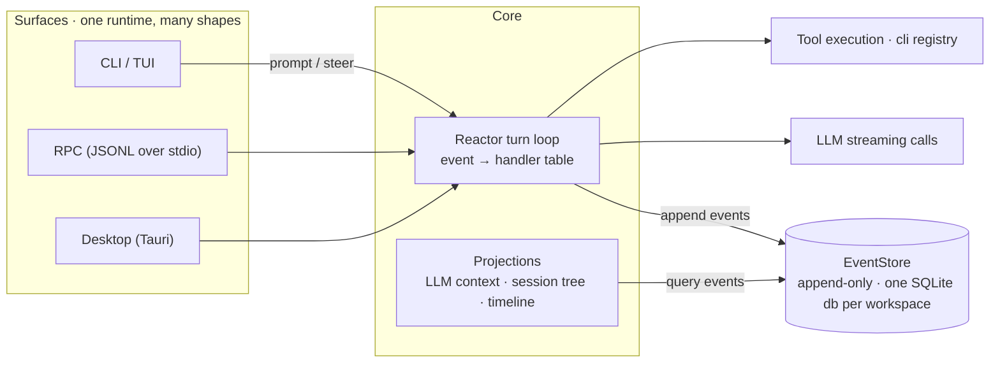

<div align="center">
  <picture>
    <source media="(prefers-color-scheme: dark)" srcset="assets/logo-lockup-dark.svg">
    
  </picture>

  <p>
    <strong>The coding agent that runs on an event log.</strong><br>
    The session is the log, every UI is a projection — replayable, auditable, forkable at every step.
  </p>

  <p>
    <a href="https://github.com/wuzhuangzhishengji2026/zharness/actions/workflows/ci.yaml"></a>
    
    
    
  </p>

  <p>
    <a href="#04--quick-start">Quick Start</a> ·
    <a href="#06--docs">Docs</a> ·
    <a href="docs/DESIGN-RATIONALE.zh-CN.md">Design Rationale</a> ·
    <a href="README.zh-CN.md">中文</a>
  </p>
</div>

---

## 00 · At a glance

```text
$ zharness
● session attached                                events: 0
● user      "refactor the event store"            evt-0001
● model     plan ready — 2 files                  evt-0002
● tool      cli edit runtime.ts                   ✓ evt-0003
● user      "that version was wrong, rewind"
● agent     rewound to evt-0002, forked a branch  ✓
```

This is not a demo animation — it is ZHarness's worldview: **everything you see in a session is an event.**
Messages are events, model calls are events, tool results and file edits are events. Nothing exists until it is written to the log, and once written it never changes.

## 01 · Why another harness

Most coding agents run a `while True` loop: the model says a step, a tool runs it, and the step is gone. Context lives in the window, history lives in memory — when a run goes sideways, the only option is to start over.

ZHarness flips that around: **the log comes first, the session is derived from it.**

- The system holds exactly one source of mutable state: an append-only event log (one SQLite database per workspace);
- The LLM context, the session tree, the timeline, and every surface — CLI, TUI, desktop — are **live projections** of that log, like database views over their underlying tables: no independent state, rebuilt / audited / replayed at any time.

"Something went wrong" stops being a disaster: rewind to any event, fork a new session from any historical message, or replay an entire run like footage — all ordinary queries over the same log.

## 02 · Mental model



## 03 · Core design

- **Reactor-driven turn loop** — every turn is a state machine driven by an event → handler table: an event arrives, the table is consulted, work is dispatched, state transitions. Unlike the usual `while True` loop, every step's input and output is reliably handled and traceable.
- **The log is the single source of truth** — every message, model call, tool result, and file change is written to an immutable EventStore; state can be rebuilt, audited, and replayed.
- **One tool to rule the file system** — the model sees exactly one tool, `cli`; read/write/edit and other commands are routed through it. The tool surface collapses into a single command channel — friendly to progressive disclosure, and every tool call looks the same in the log.
- **One runtime, many shapes** — CLI, interactive TUI, RPC, and desktop GUI all consume the same event stream; underneath it is always the same agent.
- **Git-log-like branch tree memory** — a session can fork from any historical message, with read-only views and timeline rewind.

## 04 · Quick Start

> Requirements: Node.js ≥ 22.5. Building the desktop app additionally needs Rust (Tauri 2) and Bun.

```bash
git clone https://github.com/wuzhuangzhishengji2026/zharness.git
cd zharness
npm install
npm run build
npm link            # or: node dist/src/cli.js

zharness            # interactive TUI
npm run dev:desktop # desktop app (dev mode)
npm test            # offline tests
```

On first use, configure a model provider in "Settings → Provider" of the TUI/desktop app; configuration lives under `~/.zharness/`.

## 05 · Features

- Terminal CLI (`zharness --help`) + interactive TUI
- Desktop app (Tauri 2): workspace management, file explorer, event timeline, replay view, SOP market, skills/extensions/model configuration
- Session branch trees and replay summaries (replay-summary built-in extension)
- SOP market and dynamic workflow engine (builtin sops: code-review, deep-research, dynamic-task, weekly-report)
- Built-in skills (api-map, self-optimization) and extensions (codegen pipeline, proactive assistant, persistent main agent)
- RPC integration surface (`--mode rpc`, JSONL over stdin/stdout) for embedding
- Scheduled tasks with a cross-workspace dispatcher

## 06 · Docs

| Doc | Contents |
|---|---|
| [User Guide](USER-GUIDE.zh-CN.md) (Chinese) | CLI / slash commands / desktop / model tools cheat sheet |
| [Deep Dive](docs/DEEP_DIVE.zh-CN.md) (Chinese) | Architecture, event sourcing, tool system, memory — explained from scratch |
| [Architecture Wiki](wiki/) (Chinese) | Overview, Reactor loop, session tree & timeline, RPC & desktop, SOP market, knowledge library spec |
| [Design Rationale](docs/DESIGN-RATIONALE.zh-CN.md) (Chinese) | Why an event-driven harness: trade-offs vs. Pi / DSH |
| [Persistent Agent Design](docs/PERSISTENT-AGENT.zh-CN.md) (Chinese) | Design doc for the resident persona agent at `~/.zharness/main` |

## 07 · Contributing

Issues and PRs are welcome — see [CONTRIBUTING.md](CONTRIBUTING.md). Please follow [Conventional Commits](https://www.conventionalcommits.org/) for commit messages.

## 08 · Lineage & acknowledgments

ZHarness now follows its own path, but it stands on the shoulders of an open-source lineage of event-driven agents: upstream [Pizza / Rango](https://github.com/tomsun28/pizza) and Mario Zechner's [Pizza](https://github.com/badlogic/pizza); the interactive shell and model layer build on the Pi ecosystem packages `@earendil-works/pi-tui` and `@earendil-works/pi-ai`. Thanks to the authors and communities behind these projects.

## License

[MIT](LICENSE)
