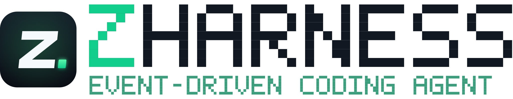
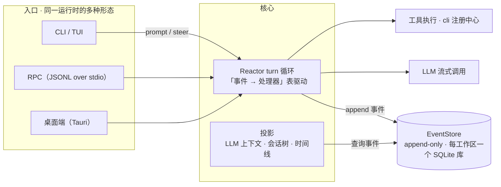

<div align="center">
  <picture>
    <source media="(prefers-color-scheme: dark)" srcset="assets/logo-lockup-dark.svg">
    
  </picture>

  <p>
    <strong>跑在事件日志上的编码 Agent。</strong><br>
    会话即日志，界面即投影 —— 每一步都可回放、可审计、可分叉。
  </p>

  <p>
    <a href="https://github.com/wuzhuangzhishengji2026/zharness/actions/workflows/ci.yaml"></a>
    
    
    
  </p>

  <p>
    <a href="#04--快速开始">快速开始</a> ·
    <a href="#05--文档地图">文档地图</a> ·
    <a href="docs/DESIGN-RATIONALE.zh-CN.md">设计理念</a> ·
    <a href="README.md">English</a>
  </p>
</div>

---

## 00 · 一眼看上去

```text
$ zharness
● session attached                                events: 0
● user      「帮我重构 event store」               evt-0001
● model     已给出 2 个文件的改动计划              evt-0002
● tool      cli edit runtime.ts                    ✓ evt-0003
● user      「刚才那版不对，退回去」
● agent     回退到 evt-0002，从该点分叉出 branch    ✓
```

这不是演示动画，这是 ZHarness 的世界观：**你在会话里看到的一切，都是一条条事件。**
消息是事件，模型调用是事件，工具结果和文件改动也是事件。事件落库之前不存在，落库之后不再改变。

## 01 · 为什么又造一个 Harness

大多数编码 Agent 的主循环是一个 `while True`：模型说一步，工具跑一步，跑完就丢。上下文只在窗口里，过程只在回忆里——一旦跑偏，除了整轮重跑别无他法。

ZHarness 把这件事反过来：**先有日志，后有会话。**

- 整个系统只有一份可变状态：append-only 的事件日志（每个工作区一个 SQLite 库）；
- LLM 上下文、会话树、时间线、桌面端/TUI 的每个界面，都是这条日志的**实时投影**——如同数据库视图之于底层表，不持有独立状态，随时可重建、可审计、可回放。

于是"出错"不再是灾难：退回任意一条事件、从任意一条消息分叉出新会话、把一整段执行当成录像回放，都是对同一条日志的普通查询。

## 02 · 心智模型



## 03 · 核心设计

- **Reactor 驱动的 turn 循环** — 每个 turn 是一张「事件 → 处理器」表驱动的状态机：事件到来，查表，分发，状态流转。区别于常见的 `while True` 主循环，每一步的输入输出都被可靠处理、可追踪。
- **日志是唯一事实源** — 每条消息、模型调用、工具结果和文件变更都写入不可变 EventStore；状态可重建、可审计、可回放。
- **一个 `cli` 工具打天下** — 模型只见到一个 `cli` 工具，读写编辑等命令经它路由执行。工具面收敛为一条命令通道，天然契合渐进式披露，也让每一次工具调用在日志里长得一模一样。
- **同一运行时，多种形态** — CLI、交互式 TUI、RPC、桌面 GUI 共享同一个事件流；底下始终是同一个 Agent。
- **Git Log 式的分支树记忆** — 会话可以从任意一条历史消息分叉，支持只读查看与时间线回退。

## 04 · 快速开始

> 依赖：Node.js ≥ 22.5。构建桌面端另需 Rust（Tauri 2）与 Bun。

```bash
git clone https://github.com/wuzhuangzhishengji2026/zharness.git
cd zharness
npm install
npm run build
npm link            # 或 node dist/src/cli.js

zharness            # 交互式 TUI
npm run dev:desktop # 桌面端（开发模式）
npm test            # 离线测试
```

首次使用在 TUI/桌面端「设置 → 服务商」中配置模型 API 即可；配置存储于 `~/.zharness/`。

## 05 · 功能一览

- 终端级 CLI（`zharness --help`）+ 交互式 TUI
- 桌面端（Tauri 2）：工作区管理、文件浏览、事件时间线、回放视图、SOP 市场、技能/扩展/模型配置
- 会话分支树与回放摘要（replay-summary 内置扩展）
- SOP 市场与动态工作流引擎（builtin-sops：code-review、deep-research、dynamic-task、weekly-report）
- 内置技能（builtin-skills：api-map、自优化）与内置扩展（codegen 流水线、主动助手、持久化主 Agent）
- RPC 集成面（`--mode rpc`，stdin/stdout JSONL），供第三方嵌入
- 计划任务（调度器）与跨工作区会话派发

## 06 · 文档地图

| 文档 | 内容 |
|---|---|
| [用户说明书](USER-GUIDE.zh-CN.md) | CLI / 斜杠命令 / 桌面端 / 模型工具 全景速查 |
| [万字深度解析](docs/DEEP_DIVE.zh-CN.md) | 从零讲解架构、事件溯源、工具系统与记忆机制 |
| [架构 Wiki](wiki/) | 架构总览、Reactor 循环、会话树与时间线、RPC 与桌面端、SOP 市场、知识库规范 |
| [设计理念随笔](docs/DESIGN-RATIONALE.zh-CN.md) | 为什么做事件驱动 Harness：与 Pi / DSH 的对比与取舍 |
| [持久化 Agent 设计](docs/PERSISTENT-AGENT.zh-CN.md) | `~/.zharness/main` 常驻人格 Agent 的设计文档 |

## 07 · 参与

欢迎 Issue 与 PR，见 [CONTRIBUTING.md](CONTRIBUTING.md)。提交信息请遵循 [Conventional Commits](https://www.conventionalcommits.org/)。

## 08 · 谱系与致谢

ZHarness 现在是一条独立的技术路线，但它站在一群事件驱动 Agent 探索者的肩膀上：上游 [Pizza / Rango](https://github.com/tomsun28/pizza) 与 Mario Zechner 的 [Pizza](https://github.com/badlogic/pizza)；交互外壳与模型接入层基于 Pi 生态的 `@earendil-works/pi-tui`、`@earendil-works/pi-ai` 等包。感谢这些项目的作者与社区。

## License

[MIT](LICENSE)
