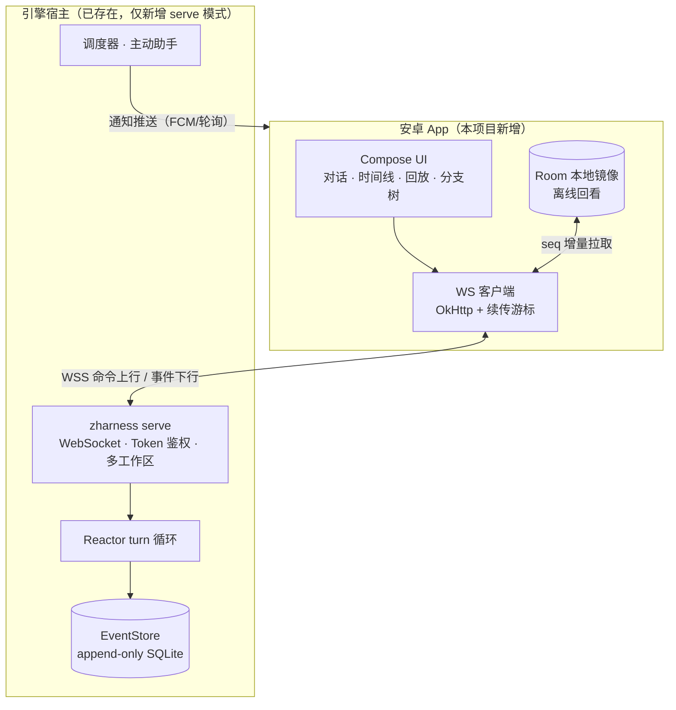

# ZHarness 安卓版设计

> 状态：**全量版已实现**（M0+M1+M2 主体+M3）· 2026-10
> 引擎侧：`zharness serve`（`packages/serve/server.ts`）+ `auth_set`/`auth_remove`（服务商密钥配置）+ `get_events.sinceSequence` 增量同步；测试 `test/serve-mode.test.ts`。
> 安卓侧（`apps/android`）：配对（粘贴 URI/手输）、对话（流式/steer/中止/图片附件）、审批流（安全模式 + INTENT_TOOL_CALL 审批卡 + approve/reject）、时间线（实时+过滤+resync 游标）、会话切换/新建、分支树分叉、回放播放器、计划任务 CRUD、SOP 市场、技能安装、扩展启停、皮肤应用、宠物盲盒互动、服务商密钥配置、报错横幅、文件离线镜像（FileMirror，断网回看，resync 自愈）。
> 前台服务保活 + 系统通知（审批/报错/完工，App 前台时自动抑制）已实现：连接与状态提升为进程级 EngineHub 单例，EngineService（dataSync 前台服务）持有常驻通知；Android 15 对 dataSync 类服务有 6 小时会话上限，超时后回到「重连 + 离线镜像」兜底。
剩余项（诚实清单）：桌面 Widget、扫码配对、xterm 终端、TLS 证书固定。
> 构建与联调：[apps/android/README.md](../apps/android/README.md)。

---

## 00 · 结论先行

**可以做到，而且比一般项目顺理成章。** ZHarness 的世界观是「日志是唯一事实源，一切界面都是投影」——安卓版不是移植，而是**新增一个投影面**。桌面端已经是「壳 + sidecar 引擎」结构（Tauri 壳 + Node 引擎），安卓版复制同一模式即可。

推荐路线：**一个 APK，两种形态，共享同一协议。**

| 形态 | 引擎跑在哪 | 适用场景 |
|---|---|---|
| **远程模式（v1 先做）** | 你的电脑 / 家里的服务器 / 任意常开主机 | 手机随时接入桌面工作区，接住计划任务通知、审批请求 |
| **本机模式（v2 验证）** | Termux 里的同一个引擎，监听 127.0.0.1 | 无网络也能用的「随身离线 Agent」 |

两种形态对 App 而言**只有连接地址不同**，协议、代码、交互完全一致。

### 可行性依据（来自现有代码的证据）

- `packages/protocol` 已经是**零依赖**协议包——RPC 类型本就为「第三方消费者」设计，安卓端直接消费 JSON 即可；
- `packages/http-bridge/server.ts` 已经实现了 HTTP POST + SSE 的 GUI 服务面（`--mode gui`）——网络传输层已有 70% 的底子，缺的是 WebSocket、鉴权与增量续传；
- `src/core/event-store/sqlite-store.ts` 使用 **`node:sqlite`（Node 内置）**，没有 better-sqlite3 这类原生编译依赖——引擎跑进 Termux 的最大障碍已不存在；
- 桌面端 web UI（`apps/web`）通过 `transport.ts` 抽象与引擎通信，Tauri 与浏览器两种传输并存——「多传输」已是既定模式。

---

## 01 · 为什么不是「重写」而是「加投影」

把 ZHarness 搬上安卓，错误做法是把 Reactor 循环、EventStore、工具系统用 Kotlin 重写一遍——那会造出第二个事实源，违背项目第一原则，且永远追不上主线的功能演进（技能、SOP、扩展、调度器……）。

正确做法是承认：**引擎只在它该在的地方跑一次，界面可以有任意多个。**



手机端要做的三件事：

1. **命令上行**：把用户动作编码为现有 RPC 命令（`session.prompt`、`history.fork`、`skin_apply`……）；
2. **事件下行**：订阅 `event-mapper` 产出的投影事件流，实时渲染；
3. **日志同步**：按 seq 增量拉取事件，落到 Room 本地镜像，支撑离线回看与秒开。

---

## 02 · 引擎侧新增：`zharness serve`

在 `packages/http-bridge` 基础上演进（而非另起炉灶），新增一个 `--mode serve`：

### 2.1 传输设计

| 项 | 决策 | 理由 |
|---|---|---|
| 协议 | **WebSocket（WSS）**，SSE 保留为降级 | 移动网络下 WS 的重连/心跳/双向语义远好于 SSE；现有 SSE 代码路径复用给浏览器 |
| 鉴权 | **Token 配对**：桌面端展示二维码（`https://<host>:<port>/pair#<one-time-token>`），手机扫码换取设备 token | 避免在手机上输入长密钥；一次性 token 防重放 |
| 加密 | 局域网：自签 TLS（证书指纹固定）；跨公网：**强烈建议 Tailscale/WireGuard**，其次反向代理 + 正式证书 | 不鼓励用户直接暴露端口 |
| 多连接 | 每个连接一个游标（`lastEventSeq`），互不干扰 | 手机与桌面同时在线是常态 |
| 心跳 | WS ping/pong 15s + 指数退避重连（1s→30s 封顶） | 应对移动网络切换 |
| 会话恢复 | 重连后先发 `events.resync {sinceSeq}`，服务端从 EventStore 补发差量，再续实时流 | 断线期间一条事件都不丢——append-only 日志让这成为普通查询 |

### 2.2 命令路由

serve 模式的命令分发表**直接复用现有 RPC 处理表**（同一张表已同时服务 TUI / `--mode rpc` / 桌面端）。新增仅三类：

- `pair.request / pair.claim`——设备配对；
- `events.resync`——按 seq 区间拉取事件（供离线镜像）；
- `push.register / push.unregister`——通知通道注册（可选，依赖 FCM 时）。

### 2.3 工作区模型

一个 serve 实例管理多个工作区（与桌面端一致）。手机端默认列出全部已配对工作区，进入即订阅该工作区事件流。工作区切换 = 换一条 WS 订阅，无需重连。

---

## 03 · 安卓 App 技术选型

**推荐：Kotlin + Jetpack Compose 原生开发。**

| 选项 | 评估 | 结论 |
|---|---|---|
| **Kotlin + Compose（推荐）** | 长期质量、系统级能力（通知/小部件/分享/前台服务/Keystore）一等公民；团队规模小也够用 | ✅ |
| React Native 复用 `apps/web` | 看似省代码，实际 `apps/web` 深度绑定 Tauri API（`invoke`/`listen`、插件）与三栏桌面布局，可复用的主要是类型与视觉风格，改造量接近重写，还要背 RN 依赖链 | ❌ 不推荐 |
| Capacitor 直接包壳 | 同上，且手机上强凑桌面三栏布局体验差 | ❌ 不推荐 |
| Flutter | 与现有 TS 生态零协同，协议类型要手工双份维护 | ❌ 不推荐 |

### 技术栈清单

```
UI          Jetpack Compose + Material 3（深色主题对齐桌面端视觉）
架构        单 Activity + Navigation Compose + ViewModel + StateFlow
网络        OkHttp WebSocket + kotlinx.serialization（JSON 协议）
本地镜像    Room（events / sessions / cursor 三张表）
安全        Android Keystore 存设备 token；API key 永不落手机（留在引擎侧）
后台        WorkManager（镜像同步）+ 前台服务（仅回放/终端等活跃场景）
终端(可选)  WebView 内嵌 xterm.js（v1.5 再做，v1 以审批卡替代）
```

### 模块划分

```
:app            壳工程、导航、DI
:core-protocol  @zharness/protocol 的 Kotlin 映射（见下）
:core-transport WS 客户端、重连状态机、resync 游标
:core-mirror    Room 镜像 + 同步引擎
:core-push      通知分发（审批请求 / 计划任务结果 / 主动助手）
:feature-chat   对话（消息流、composer、上下文编辑）
:feature-timeline  事件时间线 + 取证查看
:feature-replay 回放视图
:feature-branch 分支树与分叉
:feature-automation 计划任务管理
:feature-settings 工作区/模型/插件/技能/SOP/皮肤宠物
```

### 协议类型的消费方式

`packages/protocol` 是零依赖 TS 包。安卓侧不要手工抄类型——写一个小脚本（Node）把它解析为 JSON Schema（`ts-json-schema-generator`），再用 `jsonschema2pojo` 式工具生成 Kotlin data class，纳入 CI：**协议一变，安卓编译期即报错**，与 `apps/web` 共享同一份事实。

---

## 04 · 功能映射（桌面 → 手机）

逐项对齐，标注差异：

| 桌面端 | 手机端形态 | 差异说明 |
|---|---|---|
| ChatView 对话 | 底部 Tab 1「对话」 | 消息流 + composer，支持语音输入（IME 自带）、图片附件；上下文编辑器做成全屏弹层 |
| EventTimeline 事件时间线 | Tab 2「时间线」 | 只读、虚拟化长列表、按事件类型过滤、点击展开取证详情（forensic event） |
| BranchTreeExplorer 分支树 | 时间线内二级页 | 树形渲染 + **长按任意历史消息 → 分叉**（移动端最顺手的高频操作） |
| ReplayPage 回放 | 全屏「回放」模式 | 沉浸式逐事件播放，可当监控录像回看；前台服务保活 |
| FileExplorer 文件浏览 | 只读浏览 + 编辑走审批 | 手机上模型改文件 → 推送审批卡，而不是直接在手机上编辑 |
| Terminal（xterm） | v1：命令审批卡；v1.5：WebView 内嵌 xterm | 完整终端是键盘适配黑洞，先不啃 |
| AutomationView 计划任务 | Tab「自动化」 | 任务 CRUD（协议已支持 once/cron/每N分钟等全套）+ **执行结果推送通知**（手机比桌面强的地方） |
| PluginsView 插件/技能/SOP 市场 | 设置内管理页 | 复用 `sop_market` / `skill` / `extension` 命令族 |
| SettingsView 设置 | 设置页 | 模型/服务商配置**只读展示 + 修改走引擎侧**，API key 不进手机；皮肤/宠物全功能 |
| 宠物 / 皮肤 / 盲盒 | **安卓原生强化**：桌面 Widget（宠物蹲在桌面）、应用内悬浮宠物、开盒动画全屏化 | 移动端反而是这套功能的最佳舞台 |
| ProactiveAssistant 主动助手 | 系统通知渠道 | 通知点进直达对应会话 |
| HomeView 工作区首页 | 启动页：工作区卡片列表 + 扫码添加 | 多工作区切换是移动端首要导航 |

---

## 05 · 移动端特有的设计

### 5.1 工具审批流（安全核心）

引擎侧新增「审批模式」：手机配对默认授予 `对话 + 只读投影`，写文件 / 执行命令需要手机端点确认。

```
模型发起 cli edit src/core/agent/index.ts
  → 引擎挂起该工具调用，追加 TOOL_APPROVAL_REQUESTED 事件
  → 手机高优先级通知：「Agent 想修改 index.ts」[diff 预览] [允许] [拒绝]
  → 允许 → 引擎继续执行；30 分钟无响应默认拒绝并记录
```

已有 `output-guard.ts` 与权限体系可挂载此逻辑；审批决策本身也是事件，审计链完整。

### 5.2 分享接入

注册系统分享 Target：「发给 Agent」。任意 App 分享文本/图片 → 选择工作区 → 作为 user message 进入当前会话。这是手机作为「随身入口」的最大价值点。

### 5.3 桌面小部件

- 宠物 Widget（皮肤系统直接受益）；
- 会话状态 Widget（当前模型是否在跑、最近事件一句话）；
- 计划任务结果 Widget。

### 5.4 通知渠道

| 渠道 | 用途 | 优先级 |
|---|---|---|
| 审批请求 | 工具调用待确认 | HIGH，声音+横幅 |
| 计划任务结果 | 任务跑完/失败 | DEFAULT |
| 主动助手 | 洞察/建议 | LOW |
| 会话完成 | 长任务收尾 | DEFAULT |

无 FCM 时（局域网形态），由 WS 长连接 + 前台服务保活投递；有 FCM 时注册 `push.register` 走系统推送。

---

## 06 · 离线与同步：日志天然适合

append-only + 单调 seq 的事件日志，就是为增量同步而生的协议：

- **拉取**：`events.resync {workspaceId, sinceSeq, limit}` → 返回 `[sinceSeq+1, …]` 连续区间，游标单调前进；
- **无冲突**：日志不可变，手机端不产生事件（v1 手机只发命令，事件由引擎落库），不存在写冲突；
- **分叉**：`history.fork` 在引擎侧产生新事件而非改写历史，手机端只需同步到新分支即可；
- **本地镜像（Room）**：`events(seq, workspaceId, type, payload, createdAt)` + `sessions(id, title, branch, updatedAt)` + `meta(cursor)`。默认保留每工作区最近 7 天或 5 万条事件，LRU 淘汰；
- **秒开**：进会话先渲染镜像，WS resync 差量补齐——即使引擎离线，时间线与历史对话仍可完整回看。

---

## 07 · 端上引擎（v2）可行性评估

| 方案 | 评估 | 结论 |
|---|---|---|
| **Termux + Node 22** | Termux 社区源提供 Node 22；`node:sqlite` 内置零编译；`node-pty` 在 Termux 下可编译；`fd`/`rg` 有 Termux 包；引擎代码零改动即可 `--mode serve` 监听 127.0.0.1，App 连本机 | ✅ **v2 路线**，App 无需任何改动 |
| nodejs-mobile 嵌入 APK | 该项目运行时长期停在 Node 18/20 线，而引擎硬性要求 ≥22.5（`node:sqlite`）；等待其跟进前不可行 | ❌ 暂缓 |
| Kotlin 重写核心 | 造第二事实源，永久双轨维护 | ❌ 否决 |

Termux 形态的定位与限制要诚实写进文档：

- 后台执行受 Doze 限制：**计划任务、常驻调度仍建议留在桌面端**，Termux 形态定位为「随身离线 Agent」（前台使用 + 短后台）；
- 引擎安装引导：App 内置「一键安装向导」（拉起 Termux:Task 执行安装脚本），降低门槛；
- 这也是为什么 v1 的所有设计都锚定在「协议」而不是「本机进程」上——形态升级时 App 一行不改。

### 7.1 本机模式的自主性边界

**本机模式下手机就是宿主：引擎直连模型 API（HTTPS 出站，`undici` 纯 JS），电脑端是否开机完全无关。**
系统里不存在「必须与桌面协同」的依赖——唯一的"云"是模型 API 本身；甚至可在 models.json 里指向手机本机的
llama.cpp 端点做到全程离线（端侧模型能力有限，仅作彩蛋）。

**工具面清单（逐层）：**

| 层级 | 可用性 | 依据 |
|---|---|---|
| read / write / edit / ls / find / grep | ✅ **零安装即可用** | `src/core/tools/` 下均为纯 TypeScript 实现；`find.ts` 内置纯 JS 目录遍历，`fd`/`rg` 仅是可选加速项（`ensureTool("fd", true)` 有回退路径） |
| shell（`cli bash`） | ✅ Termux 原生可用 | 引擎经 `node:child_process.spawn` 执行（`src/core/exec.ts`），`bash-executor.ts` 抽象了 `BashOperations`；Termux 即完整 Linux 用户空间 |
| git / python / node / curl 等命令行工具 | ✅ `pkg install` 一键补强 | Termux 官方源齐备；`ripgrep`、`fd` 同样有包 |
| 联网检索 / 报告导出 | ✅ 与平台无关 | HTTP 出网纯 JS；`export-html`、`deep-research` SOP 原样可用 |
| node-pty（交互终端） | ✅ 需编译 | Termux 下 `pkg install python clang make` 后可构建 |
| 重构建（gradle / cargo / docker） | ❌ 不适合 | 算力与内存形态不匹配，属桌面/服务器职责 |

**因此调研类轻量工作（检索 → 阅读 → 整理 → 写报告 → 导出）在手机上是完整闭环，无需桌面参与。**

沙箱与后台的硬边界：

- Termux 只能写自身目录与共享存储（`termux-setup-storage`），工作区必须位于可达路径内；
- 锁屏后 Doze 会冻结/杀死后台进程——前台完成一个调研任务无碍（可加 wakelock + 前台通知延长窗口），常驻调度不建议依赖手机；
- 运行时下载的可执行文件受 Android W^X 限制（新系统禁止 app 数据目录 exec），`download-vendor-tools` 的产物在 Termux 下应禁用，改用 `pkg` 安装到 `$PREFIX` 的同名工具（位于系统级可执行路径，不受限）。

---

## 08 · 安全模型

1. **配对**：桌面端 `zharness serve` 生成二维码（host + port + 一次性 token），手机扫码 → `pair.claim` → 引擎签发设备 token（存 Android Keystore，永不落普通存储）；
2. **传输**：局域网 WSS 自签 + 证书指纹锁定（防中间人）；跨公网仅允许「Tailscale/WireGuard 或反代 + 正式证书」两种姿势，App 检测到明文公网地址直接拒绝连接并提示；
3. **授权分级**：`只读投影` / `对话` / `工具审批` / `全权`——配对时选择，可随时在引擎侧吊销（token 黑名单落 `~/.zharness/`）；
4. **命令白名单**：serve 模式下按授权级别过滤命令分发表，未授权命令直接 403，而非靠客户端自觉；
5. **密钥隔离**：模型 API key 只存在于引擎侧 `auth-storage`；手机端设置页仅显示「已配置/未配置」与模型列表（协议中 `hasAuth` 字段已有此语义）。

---

## 09 · 里程碑

| 阶段 | 内容 | 出口标准 |
|---|---|---|
| **M0 · 打通**（1–2 周） | `zharness serve` WS + token 配对 + resync；安卓最小壳：扫码、单工作区、对话 + 实时事件流 | 手机发一条 prompt，看到流式回复与工具事件 |
| **M1 · 投影完整**（2–3 周） | 时间线 / 取证详情 / 分支树与长按分叉 / 回放；Room 镜像 + 离线回看 | 断网后仍可完整回看历史会话与回放 |
| **M2 · 移动特化**（2–3 周） | 审批流 + 通知渠道 + 分享接入 + 桌面小部件 + 皮肤/宠物/盲盒 + 自动化管理 | 手机成为日常随身入口，计划任务结果可靠触达 |
| **M3 · 端上引擎**（验证性，1–2 周） | Termux 安装向导 + Termux 下引擎全量回归 + 本机模式连接 | 无网络环境下完成一次完整编码会话 |

依赖关系：M0 的 serve 模式是唯一引擎侧硬依赖，之后各阶段引擎侧改动递减（M2 主要是审批事件与推送，M3 引擎零改动）。

---

## 10 · 风险与开放问题

| 风险 | 等级 | 对策 |
|---|---|---|
| 移动网络长连接不稳 | 中 | 心跳 + 指数退避 + resync 兜底；连接状态在 UI 常显 |
| 公网暴露被扫 | 高 | App 端硬拒明文公网；文档主推 Tailscale；token 限次 + 可吊销 |
| 国产 ROM 通知到达率 | 中 | 引导用户锁后台；关键审批支持「打开 App 即见待办」兜底 |
| xterm.js 在 Android WebView 的键盘适配 | 中 | 排到 v1.5，v1 用审批卡绕开 |
| 协议演进与安卓端漂移 | 中 | 类型生成进 CI（protocol 包 → schema → Kotlin），漂移即编译失败 |
| Termux Node 版本跟进 | 低 | v2 前置检查 `node -v ≥ 22.5`，不满足则禁用本机模式入口 |
| SSE→WS 改造的语义回归 | 中 | `event-mapper` 输出快照测试先行，serve 与 gui 模式共享同一映射层 |

开放问题（实现前需定夺）：

1. 多设备同时配对同一工作区时，审批请求是否广播给所有设备（先答先得）？——建议是；
2. 手机端是否允许创建新工作区（涉及引擎侧在任意路径初始化 SQLite 库的权限边界）？——v1 建议否；
3. FCM 是否引入（引入即绑定 Google 服务，与自托管理念有张力）？——建议做成可选编译 flavor。

---

## 11 · 一句话总结

桌面端证明了「一个引擎，多种形态」；安卓版只是这条原则的又一次兑现——**引擎不动如山，日志依旧唯一，手机成为它迄今最贴身的一块投影。**
