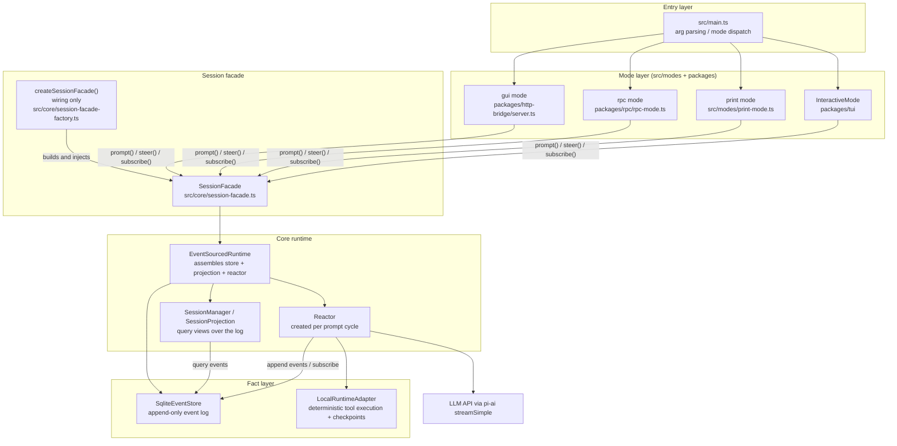
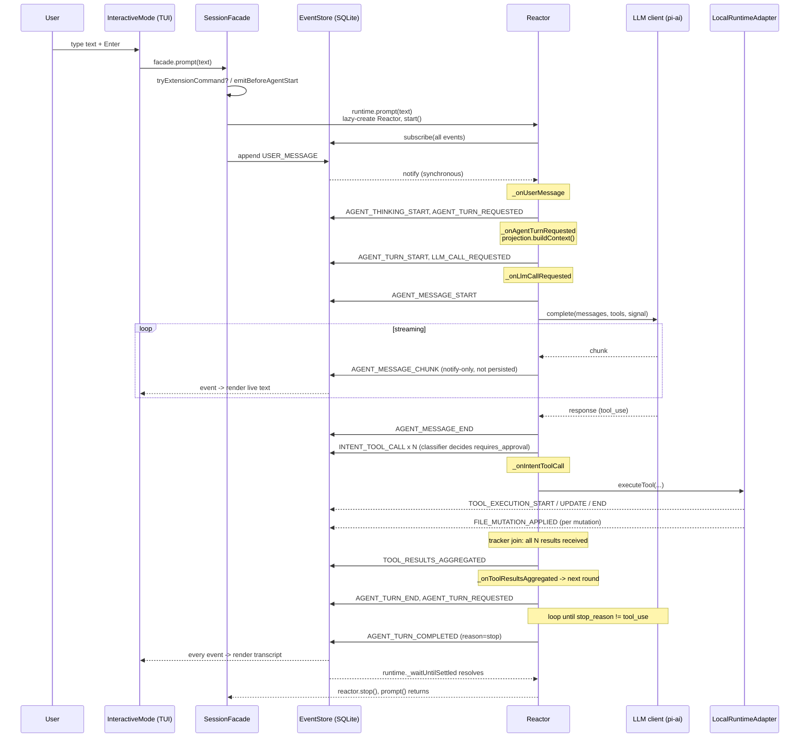
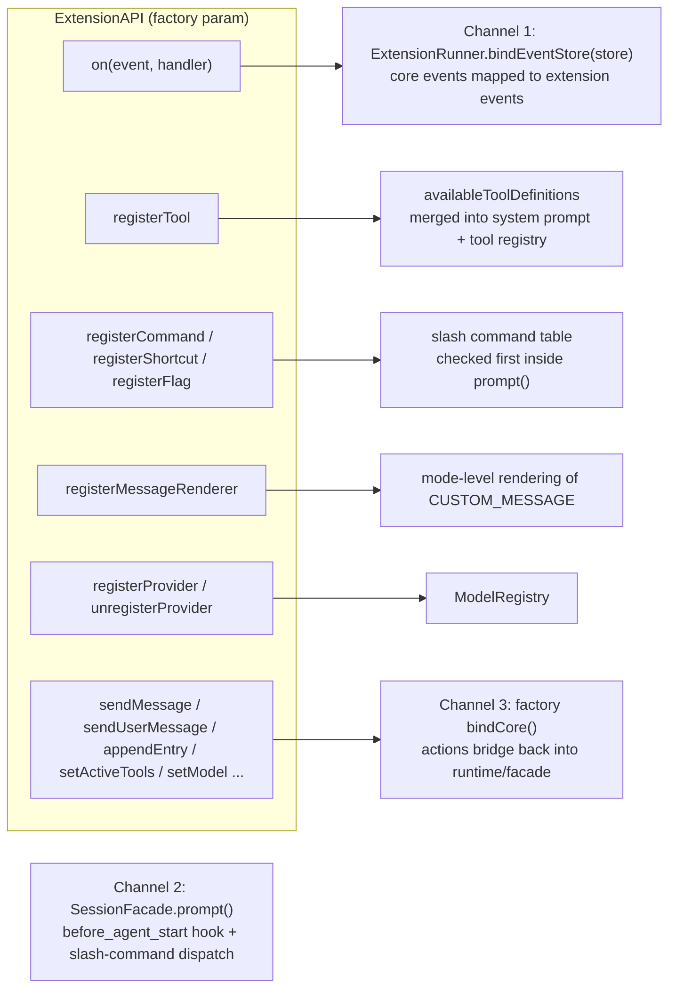

# 架构总览

zharness 是一个事件溯源（event-sourced）驱动的 LLM 编程 Agent。整个系统只有一份可变状态——append-only 的 SQLite 事件日志；UI 渲染、LLM 上下文、会话树、压缩全部是这条日志的投影。本文给出分层结构、「日志是唯一事实源」的贯穿方式、一次用户交互的端到端时序，以及扩展点地图。

项目定位与运行形态见 [01-项目概览](01-项目概览.md)；Reactor 处理器细节见 [03-Reactor循环](03-Reactor循环.md)；事件结构与存储格式见 [04-事件存储与会话树](04-事件存储与会话树.md)。

## 分层结构

各层职责与锚点文件（均已核实）：

| 层 | 职责 | 锚点 |
|---|---|---|
| 入口 | 解析 argv、解析模式（interactive / print / json / rpc / gui）、装配 `SessionServices`，然后按模式调用对应 runner | `src/main.ts:L98`（`resolveAppMode`）、`src/main.ts:L411`（`main()`） |
| 模式 | 四种界面共享同一 `SessionFacade`：TUI 订阅事件流渲染终端 UI；print 单次执行后退出；rpc 在 stdin/stdout 上跑 JSON-RPC；gui 起 HTTP+SSE 服务 | `src/modes/index.ts:L5-L10`、`packages/tui/interactive-mode.ts:L542`、`packages/rpc/rpc-mode.ts:L404`、`packages/http-bridge/server.ts:L35` |
| 门面 | 轻量入口：斜杠命令分发、`before_agent_start` 扩展钩子，其余全部转发给 runtime；自身不持有任何会话数据 | `src/core/session-facade.ts:L44`、注释 `L1-L7` |
| 工厂 | 只做一次性装配：SQLite store、投影 SessionManager、ExtensionRunner、工具表、LLM client、EventSourcedRuntime，最后包成 facade | `src/core/session-facade-factory.ts:L238`（`createSessionFacade`） |
| 运行时 | 组装 EventStore + 投影 + Reactor；每次 `prompt()` 惰性创建一个 Reactor，turn 结算后销毁 | `src/core/runtime/runtime.ts:L93`、`L158`（"Reactor lives only as long as the prompt cycle"）、`L161-L210` |
| 反应堆 | 事件驱动的主循环：订阅 store，把每类事件映射到处理器，处理器再追加新事件 | `src/core/runtime/reactor.ts:L139`、处理器注册表 `L311-L330` |
| 存储 | 唯一事实源：SQLite 单库单表 `events`，append-only，同步通知订阅者 | `src/core/event-store/sqlite-store.ts:L34`、`L60-L83` |

两点容易误解的设计：

- **facade 不是状态容器**。`SessionFacade` 的头注释明确写着 "It owns no transcript state; conversation data is read from EventStore projections through EventSourcedRuntime"（`src/core/session-facade.ts:L4-L6`）。它的价值是把「命令分发 + 扩展钩子 + runtime 转发」收敛到一个所有模式共用的入口。
- **工厂只装配不参与运行**。`createSessionFacade()`（`src/core/session-facade-factory.ts:L238-L761`）在启动时把 SqliteEventStore（`L296`）、ProjectionSessionManager（`L300`）、ExtensionRunner（`L319`）、LLM client（`L676-L712`，包装 `@earendil-works/pi-ai` 的 `streamSimple`）注入 EventSourcedRuntime（`L715`），随后 `extensionRunner.bindEventStore(store)` 让扩展进入事件流（`L746`）、发出 `session_start`（`L747`）。运行期不再有这条链路以外的耦合。

## 「日志是唯一事实源」如何贯穿各层

**问题**：同一份对话状态有多个消费方——TUI 要渲染历史、RPC 客户端要拉取状态、LLM 每轮要重建 messages、压缩要改写上下文、会话树要支持分叉回退。如果每个消费方各自维护副本，任何一处（中断、重试、steer、fork）都会造成漂移。具体例子：模型正在流式输出时用户按下 Esc 中断，若 TUI 自己维护「当前消息」缓冲而 runtime 另有一份，两者对「中断时哪半句话算数」很容易得出不同答案；再比如 fork 后 LLM 收到的上下文与 UI 显示的历史不一致。

**方案**：让一切可观察状态都是事件日志的函数。日志本身由 `EventBase` 保证形状——不可变、单调 `sequence`、UUIDv7 时间有序、`caused_by` 因果链、`correlation_id` 关联一轮交互（`src/core/event-store/types.ts:L13-L52`）；`EventStore` 接口只有 `append / query / subscribe / getCausalChain` 这类原语，没有任何 update/delete（`src/core/event-store/store.ts:L61-L112`）。

各层如何消费同一条日志：

| 层 | 从日志读什么 | 锚点 |
|---|---|---|
| Reactor | 不维护长期状态，头部注释即声明 "all mutable state lives in the EventStore"；仅存进行中的账目（turnTrackers / followUpQueue / retryTimers），且 follow-up 队列可在重启后从日志重放 | `src/core/runtime/reactor.ts:L5-L7`、`L216-L248`（`_replayPendingFollowUps`） |
| LLM 上下文 | `buildContext()` 对 `CONTEXT_RELEVANT_EVENT_TYPES`（USER_MESSAGE、AGENT_MESSAGE_END、TOOL_EXECUTION_END、COMPACTION_END 等 8 类）做范围查询再转成 messages | `src/core/projection/session-projection.ts:L20-L29`、`L56-L92` |
| 会话树 | SessionManager "manages session descriptors, not session data"，树结构从 `caused_by` 链与 descriptor 的事件区间中涌现 | `src/core/projection/session-manager.ts:L26-L30` |
| UI（四种模式） | `store.subscribe` 同步推送每个新事件，模式各自渲染或转协议 | 分发点 `src/core/event-store/sqlite-store.ts:L356-L362`（同步遍历订阅者） |
| 压缩 | 从不修改或删除旧事件；摘要结果记为一条 `COMPACTION_END`，投影据此忽略被摘要的前缀 | `src/core/compaction/compaction-engine.ts:L1-L7` |
| 审计/配置 | 连模型切换、思考级别、工具开关这类「设置」也是事件（MODEL_CHANGED、THINKING_LEVEL_CHANGED、USER_CONFIG_CHANGE） | `src/core/runtime/runtime.ts:L310-L374` |

一个刻意的例外值得注意：`AGENT_MESSAGE_CHUNK` **只通知订阅者、不落盘**（`src/core/event-store/sqlite-store.ts:L68-L76`）。流式 chunk 是易逝的渲染数据，完整内容由紧随其后的 `AGENT_MESSAGE_END.payload.content` 承载，历史重放、上下文重建、压缩都只读 END。这是「日志只存有复现价值的事实」这一原则的直接体现——既保住了唯一事实源，又不让流式噪声膨胀数据库。

## 一次用户交互的端到端时序

以默认 TUI 模式、safe mode 关闭、模型请求一次工具调用为例：

几个关键机制（均已在源码核实）：

- **级联由同步通知驱动**。`store.append()` 内部先写 SQLite 再同步遍历订阅者（`sqlite-store.ts:L60-L83`、`L356-L362`），所以 `runtime.prompt()` 里那条 `store.append({type:"USER_MESSAGE"})`（`runtime.ts:L196-L200`）会同步触发 `_onUserMessage`，后者又 append 新事件、再次触发……整条链在这个 await 内逐层展开。这也解释了为什么 `_onAgentTurnRequested` 必须先把 `_pendingContext` 存好再 emit（`reactor.ts:L497-L500` 的注释）：订阅者是同步执行的。
- **上下文来自投影而非内存**。每轮开始时 `projection.buildContext({max_tokens})` 现场查询日志构建 messages（`reactor.ts:L493-L495`、`session-projection.ts:L56-L92`），因此 split/fork/jump 之后只需换一个 projection，循环逻辑零改动（`reactor.ts:L989-L999`）。
- **结算条件是「日志比较」**。`_waitUntilSettled` 订阅 `AGENT_TURN_COMPLETED`，并检查最后一条 USER_MESSAGE 是否已被完成事件覆盖、follow-up 与 retry 队列是否清空，全部满足才结束本次 prompt 周期（`runtime.ts:L405-L437`）。
- **审批走事件**。safe mode 开启时，`requires_approval` 的 `INTENT_TOOL_CALL` 会让 reactor 挂起在一个 Promise 上等待 `USER_APPROVAL` / `USER_REJECTION` 事件（`reactor.ts:L709-L743`）；facade 默认装的是 no-op handler，真正的审批 UI 由各模式通过 `runtime.approve()/reject()` 实现（`session-facade-factory.ts:L729-L739`）。
- **防失控**。连续 6 轮完全相同的工具调用组合（名字 + 参数哈希）会被判定为死循环，强制完成本轮（`reactor.ts:L107`、`L958-L968`）。

四种模式的输入路径殊途同归：TUI 直接调 `facade.prompt/steer/followUp`（`packages/tui/interactive-mode.ts:L2656`、`L2678`、`L3422`）；RPC 把 JSON-RPC 命令翻译成同样三个方法（`packages/rpc/rpc-mode.ts:L519-L533`）；GUI 通过 HTTP POST 触发 `facade.prompt` 并用 SSE 广播事件（`packages/http-bridge/server.ts:L48-L75`）；print 顺序调用 prompt 后取最终消息退出（`src/modes/print-mode.ts:L104-L119`）。

## 扩展点地图

扩展系统是一个 TS 包导出的 `ExtensionFactory`（`src/core/extensions/types.ts:L1346`），工厂函数收到 `ExtensionAPI`（`types.ts:L1058-L1284`）。扩展通过三条物理通道接入核心：

| 扩展面 | API | 接入位置 |
|---|---|---|
| 核心事件流 | `on("message_start"/"message_end"/"turn_start"/"turn_end"/"tool_execution_*")` 等 | `extensionRunner.bindEventStore(store)` 把 store 事件翻译为扩展事件（`src/core/extensions/runner.ts:L371-L410`），工厂在启动时绑定（`session-facade-factory.ts:L746`） |
| 工具调用拦截 | `on("tool_call", handler)` 可返回结果短路执行；`on("tool_result")` 观察结果 | 同上事件映射（runner.ts:L405 起 `INTENT_TOOL_CALL` → `tool_call`） |
| 每轮提示注入 | `on("before_agent_start", handler)` 可改写 systemPrompt 或返回自定义消息 | `SessionFacade.prompt` 在调 runtime 前触发（`src/core/session-facade.ts:L87-L106`） |
| Provider 请求改写 | `on("before_provider_request")` / `on("after_provider_response")` | LLM client 包装层（`session-facade-factory.ts:L695-L710`） |
| 斜杠命令 | `registerCommand(name, ...)` | `prompt()` 先查命令表，命中则完全不进 LLM（`session-facade.ts:L121-L158`） |
| 新工具 | `registerTool(definition)` | 合入 availableToolDefinitions 并参与 system prompt 构建（`session-facade-factory.ts:L365-L389`） |
| 快捷键 / CLI flag / 自定义渲染 | `registerShortcut` / `registerFlag` / `registerMessageRenderer` | `types.ts:L1118-L1144` |
| 自定义模型提供方 | `registerProvider(name, config)` 支持 baseUrl 覆盖、OAuth、自定义 stream 函数 | 注入 ModelRegistry（`types.ts:L1213-L1280`） |
| 主动干预会话 | `sendUserMessage(content, {deliverAs})`、`sendMessage(..., {triggerTurn})`、`appendEntry`、`setActiveTools`、`setModel` | 经 `bindCore` 三组回调桥接进 runtime/settings（`session-facade-factory.ts:L560-L668`） |
| 会话生命周期 | `session_start` / `session_before_switch` / `session_before_fork` / `session_before_compact` / `session_shutdown` 等 | 启动即发 `session_start`（`session-facade-factory.ts:L747`）；完整清单见 `types.ts:L500-L590` |

内建扩展示例在 `src/builtin-extensions/`（agent-browser、codegen-sma）。扩展的编写方式与持久化 agent（`--main`，SOUL.md / memory）的关系见 [08-持久化Agent与扩展](08-持久化Agent与扩展.md)；工具注册表的实现细节见 [05-CLI工具注册表](05-CLI工具注册表.md)。

## 关键锚点文件

| 文件 | 一句话职责 |
|---|---|
| `src/main.ts` | CLI 入口：参数解析、模式分派、main-agent 锁 |
| `src/modes/index.ts` | 模式出口汇总（re-export 四个 runner） |
| `src/core/session-facade.ts` | 所有模式共享的门面；斜杠命令 + `before_agent_start` 钩子 |
| `src/core/session-facade-factory.ts` | 唯一的装配点：store、投影、扩展、工具、LLM client、runtime |
| `src/core/runtime/runtime.ts` | `EventSourcedRuntime`：组装件 + prompt/steer/followUp/abort 语义 |
| `src/core/runtime/reactor.ts` | 事件→处理器主循环；工具 join、重试、压缩编排、循环检测 |
| `src/core/runtime/local-runtime.ts` | `LocalRuntimeAdapter`：确定性工具执行 + checkpoint 服务 |
| `src/core/event-store/store.ts` | EventStore 接口（append/query/subscribe/causal chain） |
| `src/core/event-store/sqlite-store.ts` | SQLite 落地：WAL、幂等键、CHUNK 不落盘、同步通知 |
| `src/core/event-store/types.ts` | `EventBase` 与全部 `EventType` 定义 |
| `src/core/event-store/workspace.ts` | cwd → workspace_id 哈希、events.sqlite 路径规则 |
| `src/core/projection/session-projection.ts` | 日志 → LLM messages / timeline 的查询视图 |
| `src/core/projection/session-manager.ts` | 只管理 session descriptor（创建/切换/fork） |
| `src/core/extensions/types.ts` | ExtensionAPI 全量类型（约 1500 行的扩展契约） |
| `src/core/extensions/runner.ts` | 扩展加载结果的运行期代理：事件分发、命令表、工具表 |
| `src/core/compaction/compaction-engine.ts` | 无损压缩引擎：摘要写入 COMPACTION_END，不改历史 |
| `packages/tui/interactive-mode.ts` | 终端交互模式（基于 @earendil-works/pi-tui） |
| `packages/rpc/rpc-mode.ts` | stdin/stdout JSON-RPC 服务 |
| `packages/http-bridge/server.ts` | gui 模式的 HTTP + SSE 服务 |
| `apps/desktop/src/bridge.rs` | Tauri 桌面端按 cwd 拉起 `--mode rpc` sidecar（`apps/desktop/src/bridge.rs:L160-L214`） |

与既有文档（CODE_WIKI.md 等）核对后未发现结构性分歧；本文所有结论直接来自上述源码行号。桌面端与 RPC 协议细节见 [07-RPC与桌面端](07-RPC与桌面端.md)，工程实践与测试约定见 [09-开发指南](09-开发指南.md)。
