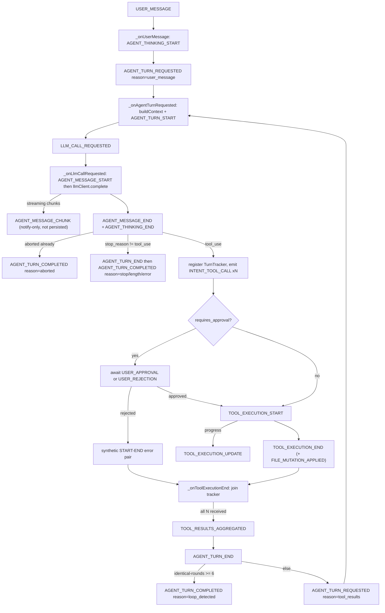
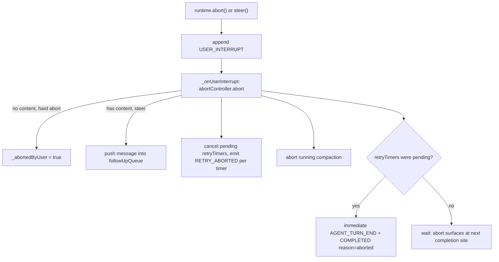

# Reactor 循环：事件驱动的 Agent 核心

> 本文核实自源码（以 `src/core/runtime/reactor.ts` 为主），所有状态名、事件名、handler 名均标注行号。与既有文档（CODE_WIKI.md、ZHARNESS_DEEP_DIVE.md）的分歧在文末单独列出。

## 定位：用「事件-处理器表」替代 while 循环

`Reactor` 是 zharness 的执行引擎核心。文件头注释开宗明义（src/core/runtime/reactor.ts:L4）：

> Replaces the AgentLoop while-loop with a set of typed handlers that react to events appended to the EventStore.

历史脉络（git 只读考证）：旧实现 `agent-loop.ts` 是典型的 `while (true)` 主循环，已在提交 `ed0e65b`（"refactor: remove agent-loop.ts and queue mode settings..."）中删除；Reactor 由提交 `71ca09c` 引入。旧设计的残留类型仍留在 src/core/agent/types.ts 中：`AgentLoopConfig`（src/core/agent/types.ts:L297）和一条过时注释「used by `agent-loop.ts` & `agent.ts`」（src/core/agent/types.ts:L240）——该文件已不存在，仅作历史线索。

### 问题 → 具体例子 → 方案

- **问题**：while 循环把「下一步做什么」编码在局部变量与调用栈里（消息数组下标、重试计数器、待完成工具列表）。中断、崩溃、并行工具失败都要求在每个循环位点手写防御逻辑。
- **具体例子**：用户在流式输出中途按 ESC。旧循环需要在每个 await 点检查 abort 标志，还要记得清理半成品消息、挂起的工具调用、排队的后续输入——漏掉一处就产生僵尸状态。
- **方案**：Reactor 把控制流反转成一张「事件类型 → 处理函数」表。每个 handler 是纯异步函数，只做两件事：读事件、发新事件（`_emit`）。循环本身消失——「下一轮」只是 `TOOL_RESULTS_AGGREGATED` 处理器再发一条 `AGENT_TURN_REQUESTED`（src/core/runtime/reactor.ts:L972-L977），由 store 订阅机制重新分发。

## 事件全集：67 个事件类型

全量定义在 src/core/event-store/types.ts:L58-L135 的 `EventType` 联合类型，共 **67 个**，分十组：

| 分组 | 数量 | 行号 | 成员示例 |
|---|---|---|---|
| User | 7 | L60-L66 | `USER_MESSAGE`、`USER_INTERRUPT`、`USER_APPROVAL`、`USER_REJECTION`、`USER_FOLLOWUP_QUEUED`、`USER_FOLLOWUP_DROPPED`、`USER_CONFIG_CHANGE` |
| Reactor control | 7 | L68-L74 | `AGENT_TURN_REQUESTED`、`AGENT_TURN_COMPLETED`、`LLM_CALL_REQUESTED`、`LLM_CALL_FAILED`、`TOOL_RESULTS_AGGREGATED`、`RETRY_SCHEDULED`、`RETRY_ABORTED` |
| Agent（LLM 输出） | 8 | L76-L83 | `AGENT_THINKING_START/END`、`AGENT_MESSAGE_START/CHUNK/END`、`AGENT_TURN_START/END`、`AGENT_ERROR` |
| Intent（LLM 提议） | 3 | L85-L87 | `INTENT_TOOL_CALL`、`INTENT_FILE_EDIT`、`INTENT_COMMAND_EXEC` |
| Execution（确定性执行） | 8 | L89-L96 | `TOOL_EXECUTION_START/UPDATE/END`、`FILE_MUTATION_APPLIED`、`BASH_EXECUTION`、`CUSTOM_MESSAGE`、`BRANCH_SUMMARY`、`COMMAND_EXECUTED` |
| Session | 5 | L98-L102 | `SESSION_CREATED`、`SESSION_BOUNDARY_INFERRED`、`SESSION_FORKED`、`SESSION_JUMPED`、`SESSION_ENTRY_APPENDED` |
| Compaction | 4 | L103-L107 | `COMPACTION_REQUESTED`、`COMPACTION_START/END`、`COMPACTION_ABORTED` |
| Runtime | 9 | L108-L117 | `RUNTIME_STARTED`、`CHECKPOINT_CREATED/RESTORED/FAILED`、`MODEL_CHANGED`、`THINKING_LEVEL_CHANGED`、`RUNTIME_ERROR` 等 |
| Goal | 7 | L118-L125 | `GOAL_CREATED` … `GOAL_CANCELLED` |
| Task | 9 | L126-L135 | `TASK_CREATED` … `TASK_CANCELLED` |

每条事件的公共信封是 `EventBase`（src/core/event-store/types.ts:L13-L52）：`sequence`（workspace 内单调递增）、`event_id`（UUIDv7，时间有序）、`actor_id`（`"user" | "coder_agent" | "runtime" | "compactor"` 或自定义，L55）、`caused_by`（因果父事件）、`correlation_id`、`thread_id`、`schema_version`、可选 `idempotency_key`。

**Reactor 自己只处理其中 17 种**，其余事件由投影（projection）、UI 与各运行模式消费。Reactor 会发出的事件共 28 种（含上表中未注册为 handler 但由它产生的，如 `AGENT_MESSAGE_CHUNK`、`TOOL_EXECUTION_START`、`FILE_MUTATION_APPLIED`、`RETRY_*`、`COMPACTION_*`、`USER_MESSAGE`、`USER_FOLLOWUP_DROPPED`、`AGENT_THINKING_START/END`、`AGENT_TURN_START/END`、`RUNTIME_STARTED`、`RUNTIME_ERROR`）。

## 处理器注册表

```ts
// src/core/runtime/reactor.ts:L89-L92
export type EventHandler = (event: EventBase) => void | Promise<void>;
export type EventHandlerMap = Partial<Record<EventType, EventHandler>>;
```

构造函数里 `_registerAllHandlers()` 一次性填表（src/core/runtime/reactor.ts:L311-L331）。**实际 17 个键、15 个去重后的处理方法**：

| 事件类型 | 处理方法 | 定义行号 | 职责 |
|---|---|---|---|
| `USER_MESSAGE` | `_onUserMessage` | L404 | 重置循环检测签名；发 `AGENT_THINKING_START`（L412）+ `AGENT_TURN_REQUESTED`（L420） |
| `USER_INTERRUPT` | `_onUserInterrupt` | L429 | abort 入账（见下文专节） |
| `USER_FOLLOWUP_QUEUED` | `_onUserFollowupQueued` | L480 | 压入内存 followUpQueue |
| `AGENT_TURN_REQUESTED` | `_onAgentTurnRequested` | L487 | `projection.buildContext()` 组上下文；发 `AGENT_TURN_START`（L503）+ `LLM_CALL_REQUESTED`（L511） |
| `LLM_CALL_REQUESTED` | `_onLlmCallRequested` | L521 | 发 `AGENT_MESSAGE_START` 后调 `llmClient.complete()`；流式 chunk 转 `AGENT_MESSAGE_CHUNK`；异常转 `LLM_CALL_FAILED` |
| `AGENT_MESSAGE_END` | `_onAgentMessageEnd` | L612 | 分叉点：无 tool_use 则收尾，有则建 tracker 并逐个发 `INTENT_TOOL_CALL` |
| `INTENT_TOOL_CALL` | `_onIntentToolCall` | L698 | 审批门 → `_executeTool` |
| `TOOL_EXECUTION_END` | `_onToolExecutionEnd` | L841 | 发 `FILE_MUTATION_APPLIED`；join-pattern 记账 |
| `TOOL_RESULTS_AGGREGATED` | `_onToolResultsAggregated` | L930 | 收尾或发起下一轮 |
| `LLM_CALL_FAILED` | `_onLlmCallFailed` | L1075 | 排期重试或以 error 收尾 |
| `AGENT_TURN_COMPLETED` | `_onAgentTurnCompleted` | L1018 | 丢弃/派发 follow-up、错误补重试、压缩检查 |
| `USER_APPROVAL` | `_onUserApproval` | L1181 | resolve 挂起的审批 Promise |
| `USER_REJECTION` | `_onUserRejection` | L1192 | reject 同上 |
| `COMPACTION_REQUESTED` | `_onCompactionRequested` | L1203 | 编排压缩生命周期 |
| `SESSION_BOUNDARY_INFERRED` | `_onSessionBoundaryInferred` | L989 | 切换活动会话后刷新 projection 与 systemPrompt |
| `SESSION_FORKED` | `_onSessionBoundaryInferred` | L328 | 同一方法复用 |
| `SESSION_JUMPED` | `_onSessionBoundaryInferred` | L329 | 同一方法复用 |

## 分发机制：同步级联 + 错误隔离

两个关键语义决定了全部代码风格：

1. **append 即同步分发**。`SqliteEventStore.append` 在插入后立刻逐个调用订阅者（`_notify`，src/core/event-store/sqlite-store.ts:L356-L362），不做异步排队；订阅匹配只按 `types`/`actor_ids`/`after` 过滤（`matchesSubscription`，sqlite-store.ts:L383-L390）。因此 handler 里每次 `_emit` 都会**同步重入**下一个 handler，直到某个 handler 遇到真正的 `await` 才让出控制权。这解释了 reactor.ts:L497-L500 的注释：`_onAgentTurnRequested` 必须先把 `_pendingContext` 存好再 `_emit`，否则同步触发的 `_onLlmCallRequested` 读不到上下文。

2. **handler 异常不外抛**。`_dispatch` 用 try/catch 包住每个 handler，异常转成 `RUNTIME_ERROR` 事件入账后继续运行（src/core/runtime/reactor.ts:L276-L291）——单个 handler 崩溃不会杀死整个循环。

另一个持久化细节：`AGENT_MESSAGE_CHUNK` 只通知订阅者、**不落库**（sqlite-store.ts:L73-L76）——完整内容由随后的 `AGENT_MESSAGE_END.payload.content` 承载，回放/重建上下文只读 END，chunk 纯粹是给实时 UI 的流。

## 一个 turn 的完整状态旅程



逐步说明（行号均在 src/core/runtime/reactor.ts）：

1. **入口**：模式层经 `SessionFacade.prompt()`（src/core/session-facade.ts:L79-L108）调 `EventSourcedRuntime.prompt()`。runtime 先懒创建一个 Reactor 并 `start()`（src/core/runtime/runtime.ts:L158-L189，注释明确 "Reactor lives only as long as the prompt cycle"——Reactor 是短命对象，随每个 prompt 周期生灭），再 append 一条 `USER_MESSAGE`（runtime.ts:L196-L200），最后 `await` settle 协议。
2. **组上下文**：`_onAgentTurnRequested` 用 `projection.buildContext({max_tokens})` 从事件日志现算 LLM 消息列表（L493-L495）。上下文来源是固定的八种「进上下文」事件（`CONTEXT_RELEVANT_EVENT_TYPES`，src/core/projection/session-projection.ts:L20-L29），工具结果以 `TOOL_EXECUTION_END` 事件形式重新进入下一轮上下文——不需要内存里的消息数组。
3. **LLM 调用**：`llmClient.complete()` 带 `abortController.signal` 和 `onChunk` 回调（L536-L552）。真实客户端由 `buildLlmClientFromStreamFn` 包装 pi-ai 的 `streamSimple`（src/core/runtime/ai-client.ts:L30-L210），并把 `stopReason === "toolUse"` 归一化为 `"tool_use"`（ai-client.ts:L201-L205）。
4. **分叉**：`_onAgentMessageEnd` 用 `extractToolCalls`（src/core/projection/event-to-message.ts:L280-L299）从 content 提取 tool_call 块。`stop_reason !== "tool_use"` 即终局，`AGENT_TURN_COMPLETED` 的 `reason` 取值为 `"stop" | "length" | "error"`（L649）；否则进入工具轮。
5. **工具轮收口**：`_onToolResultsAggregated` 发 `AGENT_TURN_END` 后二选一——熔断（`reason: "loop_detected"`，L961-L969）或 `AGENT_TURN_REQUESTED(reason: "tool_results")` 回到第 2 步（L972-L977）。

`AGENT_TURN_REQUESTED` 的 `payload.reason` 全集：`"user_message"`（L423）/ `"tool_results"`（L975）/ `"retry"`（L1151，附 `retry_attempt`）；`AGENT_TURN_COMPLETED` 的 `payload.reason` 全集：`"stop"` / `"length"` / `"error"`（L649、L1094）/ `"aborted"`（L473、L632、L944）/ `"loop_detected"`（L965）。这两个枚举就是 Reactor 的「状态转移表」——转移关系完全可由事件日志离线重放出来。

端到端断言见 test/reactor.test.ts:L109-L142：一次「echo 工具 + 收尾」的 turn 精确产生 2 条 `AGENT_TURN_REQUESTED`、2 条 `LLM_CALL_REQUESTED`、1 条 `INTENT_TOOL_CALL`、1 条 `TOOL_RESULTS_AGGREGATED`、1 条 `AGENT_TURN_COMPLETED(reason="stop")`。

**外层 settle 协议**：`EventSourcedRuntime._waitUntilSettled`（runtime.ts:L408-L437）只订阅 `AGENT_TURN_COMPLETED`，在微任务里复查三件事才 resolve：无 pending follow-up（`pendingFollowUpCount`，reactor.ts:L384）、无 pending retry（`pendingRetryCount`，L389）、最后一条 `USER_MESSAGE` 的 sequence 不大于最后一条 `AGENT_TURN_COMPLETED`（防止链式 follow-up 轮提前放行）。这就是「while 循环」的最后残余——但它等待的是事件序列，不是驱动事件。

## 并行工具调用：join-pattern

同一轮 assistant 消息的 N 个 tool_call 各自成为独立事件，天然并发：

- `_onAgentMessageEnd` 为整轮注册一个 `TurnTracker`（接口 L131-L137：`assistantMessageEventId`、`expectedCount`、`expectedToolCallIds` 集合、`received` 数组、`abortSignal`），以 assistant 消息的 event_id 为键存入 `turnTrackers` Map（L142、L655-L663）。
- 每个 `INTENT_TOOL_CALL` handler 独立跑完审批与执行（同步分发让它们都在同一个 tick 启动，在各自的第一个 `await` 处并发展开）；`_executeTool` 通过 `runtimeAdapter.executeTool` 执行（L749-L779；本地实现见 src/core/runtime/local-runtime.ts:L34-L54），流式进度走 `TOOL_EXECUTION_UPDATE`（L781-L796）。
- 每个 `TOOL_EXECUTION_END` 回到 tracker 记账：先沿 `caused_by` 因果链找最近的 `AGENT_MESSAGE_END`（L877-L888），找不到时退化为按 `tool_call_id` 扫描全部 tracker（L890-L900）；重复结果按 tool_call_id 幂等去重（L903）；集齐 `expectedCount` 即删除 tracker 并发 `TOOL_RESULTS_AGGREGATED`（附 `any_error` 汇总）（L913-L925）。
- **被拒绝的工具也必须出账**：审批被拒或缺审批处理器时，`_emitToolExecutionRejected` 补发一对合成 `TOOL_EXECUTION_START`→`END(is_error)`（L820-L837），否则 join 永远凑不齐、turn 卡死。测试覆盖了这条路径（test/reactor.test.ts:L451-L506）。
- 三工具并行的聚合断言见 test/reactor.test.ts:L334-L387（`tool_call_count: 3`，恰好 1 次 `TOOL_RESULTS_AGGREGATED`）。

值得注意：工具定义上有 `executionMode?: "sequential" | "parallel"` 字段（src/core/agent/types.ts:L50、L145），但 Reactor 完全不读取它（src/core/runtime/ 下零引用）——Reactor 路径中同轮工具一律并发，顺序执行是旧 agent-loop 的遗留概念。

## 审批门（approval gate）

`_onAgentMessageEnd` 对每个 tool_call 调 `classifier.classify()` 得出 `requires_approval`（L675）。需要审批时，`_onIntentToolCall` 挂起在一个永不超时的 Promise 上，resolve 函数存进 `_pendingApprovals` Map（L693-L696），同时回调 `approvalHandler.requestApproval`（L720-L733）。用户裁决也是事件：UI 调 `runtime.approve()/reject()`（src/core/runtime/runtime.ts:L442-L459）append `USER_APPROVAL`/`USER_REJECTION`，对应 handler 从 Map 取出并 resolve（L1181-L1199）。safe-mode 行为有完整测试：阻塞至批准（test/reactor.test.ts:L508-L580）、拒绝后以错误结果继续聚合（test/reactor.test.ts:L582-L645）。

## 中断 / abort 入账

中断有三条入口，全部汇成一条 `USER_INTERRUPT` 事件（硬中止还叠加 `interrupt()` 直接 abort 当前 `AbortController`）：



要点（行号均 src/core/runtime/reactor.ts，`_onUserInterrupt` 位于 L429-L477）：

- **硬中止 vs steer 的区分**靠 payload 是否带 content：无 content 置 `_abortedByUser = true`（L433-L435）；带 content 则把新消息塞进 followUpQueue（L438-L444），等当前 turn 以 aborted 收场后再作为全新 `USER_MESSAGE` 重启（此时会换新的 `AbortController`，L1052）。
- **abort 在三个位点显式入账**为 `AGENT_TURN_COMPLETED(reason:"aborted")`：消息结束时（L621-L636）、工具结果聚齐时（L933-L948）、以及打断挂起重试时（L464-L476，注意这个立即收尾仅在确有重试计时器被取消时触发）。
- **重试计时器清算**：每个被取消的挂起重试都补一条 `RETRY_ABORTED(attempt, reason:"user_interrupt", ...)`（L448-L463）——中断不是悄悄吞掉定时器，而是留痕。
- **follow-up 的生死簿**：`_onAgentTurnCompleted` 发现 `_abortedByUser` 时清空队列，并把被丢弃项持久化为 `USER_FOLLOWUP_DROPPED(dropped_event_ids)`（L1023-L1041）。配合重启防护（见下），保证「重启后不复活幽灵消息」。
- **重启防护三条件**（`_replayPendingFollowUps`，L206-L248）：只重放本进程运行期内（timestamp ≥ 最近 `RUNTIME_STARTED`，L236-L244）排队、尚未被 `USER_MESSAGE.caused_by` 认领（L221-L224）、未被显式 drop（L227-L232）的 follow-up。
- runtime 层兜底：若 abort 到达时根本没有 turn 在跑，直接 resolve settled 防止挂死（src/core/runtime/runtime.ts:L257-L260）。

## 失败与重试

重试有两个入口，最终都收敛到 `_scheduleRetry`（L1122-L1162）：

1. **LLM 调用抛异常**：`_onLlmCallRequested` 的 catch 发 `LLM_CALL_FAILED(error, retryable)`（L555-L565）→ `_onLlmCallFailed`（L1075-L1104）。
2. **turn 以 error 完成**：`_onAgentTurnCompleted` 里的 `_scheduleRetryForCompletedError`（L1106-L1115）补查 `reason === "error"` 的完成事件。两道防重复闸门：配置开关 `retryAssistantErrorCompletions !== false`（L1107），以及 `_errorAlreadyHandledByLlmFailure`——若完成的 `caused_by` 已是 `LLM_CALL_FAILED` 则不再二次排期（L1117-L1120）。

策略对象 `DefaultRetryPolicy`（src/core/runtime/policies.ts:L28-L50）：默认最多 3 次（L34），指数退避 1s→2s→4s、封顶 30s（L46-L49），可重试判定为 HTTP 429/5xx 状态码加一组正则（overloaded、rate limit、timeout、socket hang up 等，L39-L44）。

排期本身也是事件驱动的：先落一条 `RETRY_SCHEDULED(attempt, max_attempts, delay_ms, error_message)`（L1133-L1143），再挂真实 `setTimeout`；到点后只有未被打断才补发 `AGENT_TURN_REQUESTED(reason:"retry", retry_attempt:N)`（L1145-L1155）。**已尝试次数不存内存变量，而是沿因果链回溯取见过的最大 `retry_attempt`**（`_attemptCount`，L1165-L1177）——即使进程崩溃重启，次数也能从日志重建。彻底失败时以区分文案收尾：`Max retries (N) exceeded` / `Retry backoff exhausted`（L1090-L1103）。测试确认不可重试错误直接一次收尾（test/reactor.test.ts:L300-L332）。

## 死循环熔断：相同工具轮熔断器

- 问题：模型可能反复调用同一工具、同样参数（例如对 `session_split` 无限重试），turn 永不结束。
- 具体参数：`MAX_CONSECUTIVE_IDENTICAL_TOOL_ROUNDS = 6`（src/core/runtime/reactor.ts:L107）。签名 = 每轮全部 tool_call 的 `name:FNV1a(args哈希)` 排序后拼接（`hashArguments` L113-L121，签名生成 L668-L671），每次新 prompt 周期清零（L409）。连续 6 轮签名一致即判死循环，`AGENT_TURN_COMPLETED(reason:"loop_detected")`（L961-L969，判定 `_isInToolLoop` L1005-L1011）。
- 关键设计：**参数参与签名**。模型连跑 8 个不同命令是正常工作流，不该误杀——test/reactor.test.ts:L780-L833 验证不同参数永不触发；test/reactor.test.ts:L835-L877 验证完全相同的调用在第 6 轮精确截停（`calls === 6`）。

## 压缩挂钩（简述）

非 error、非 aborted 的 turn 完成后触发 `_checkCompaction`（L1264-L1295）：overflow 优先于阈值判断（避免同轮双发 `COMPACTION_REQUESTED`，L1271-L1283）；阈值条件为估算 token > contextWindow × threshold。定位上一条 assistant 消息改用因果链回溯（`_findLastAssistantMessage`，L1301-L1307）而非成员变量——注释明说这是为了消除「可变状态与同步分发竞态」（L1267-L1268），这是理解本项目并发模型的最佳注脚。压缩执行编排（`COMPACTION_START/END/ABORTED`，用户取消走 `COMPACTION_ABORTED`）见 `_onCompactionRequested`（L1203-L1258）；策略细节归 [08-持久化Agent与扩展](08-持久化Agent与扩展.md)。

## 状态到底放在哪：诚实版「无状态」

文件头声称「The reactor itself is stateless — all mutable state lives in the EventStore」（src/core/runtime/reactor.ts:L6-L7）。**这句话只对了一半**。准确的说法是：

- **持久状态**（跨崩溃存活）：只有事件日志本身。turn 的历史、重试次数、被丢弃的 follow-up 全部可从日志重放推导。
- **短命协调状态**（进程内，随 prompt 周期销毁）：`abortController`、`turnTrackers`、`followUpQueue`、`retryTimers`、`_pendingApprovals`、`_pendingContext`、`_abortedByUser`、`_toolRoundSignatures`（字段声明 L141-L165）。仓库提交 `580b6ed` 也承认这些是 "short-lived coordination state"。推论：**进程崩溃后，进行中的 turn 不会被自动续跑**——这是刻意设计（宁可停下也不幽灵续传），恢复手段是用户重新 prompt 或依赖持久化 Agent 扩展（[08](08-持久化Agent与扩展.md)）。

另外 `RUNTIME_STARTED` 有两处发射：runtime 构造函数必发一条（src/core/runtime/runtime.ts:L138-L142），`Reactor.start()` 仅在 store 为空时补发（src/core/runtime/reactor.ts:L194-L200）——正常路径下前者已让 store 非空，不会重复。

## 与 while(true) 循环的可靠性差异举例

| 场景 | while(true) 循环的典型失败方式 | Reactor 方案 | 来源 |
|---|---|---|---|
| 单个步骤抛异常 | 异常逃出主循环，整个 agent 进程退出 | `_dispatch` 捕获后转为 `RUNTIME_ERROR` 事件，循环继续 | src/core/runtime/reactor.ts:L276-L291 |
| 用户流式中途打断 | 需在每个 await 点检查标志；半成品消息、挂起工具易成孤儿 | 一条 `USER_INTERRUPT` 入账；signal 传播给 LLM/工具；收尾统一记 `reason:"aborted"`；被取消的重试逐一记 `RETRY_ABORTED` | reactor.ts:L429-L477 |
| 崩溃后恢复 | 内存队列、计数器全丢；重启后行为取决于上次崩溃位置 | 日志即真相：重试次数从因果链重算（`_attemptCount`），幽灵 follow-up 被 `RUNTIME_STARTED` 时间戳 + `caused_by` 认领 + `USER_FOLLOWUP_DROPPED` 三重防线挡住 | reactor.ts:L1165-L1177、L206-L248、L1023-L1041 |
| 并行工具部分失败 | 手写 `Promise.allSettled` 记账，遗漏一个就永久挂起 | join-pattern 按 event_id 记账；被拒调用补合成 START→END 保证凑齐；重复 END 幂等去重 | reactor.ts:L131-L137、L820-L837、L903 |
| 模型死循环 | 计数器散落各处或干脆没有 | 统一熔断器，参数敏感签名，第 6 轮截停并入账 `loop_detected` | reactor.ts:L107、L961-L969 |
| 观测与调试 | 断点 + 日志 | 每次状态转移都是可查询事件；`store.query({types:[...]})` 即可断言整条轨迹 | test/reactor.test.ts:L109-L142 |

代价也要说清楚：同步重入的分发模型要求开发者理解「`_emit` 会立刻执行下游 handler 直到第一个 await」，否则就会写出 `_pendingContext` 那类需要注释专门警告的顺序陷阱（reactor.ts:L497-L500）；审批 Promise 无超时，UI 不回复则 turn 悬挂（由 UI 层的取消流程兜底）。

## 关键文件速查

| 文件 | 内容 |
|---|---|
| src/core/runtime/reactor.ts | 本页主角：handler 表（L311-L331）、全部 turn 逻辑 |
| src/core/runtime/policies.ts | `RetryPolicy`/`CompactionPolicy` 策略接口与默认实现 |
| src/core/runtime/types.ts | `RuntimeAdapter`（工具执行 + checkpoint 抽象） |
| src/core/runtime/local-runtime.ts | 本地适配器，转发到 ToolRegistry |
| src/core/runtime/ai-client.ts | pi-ai streamSimple → `LLMClient` 包装 |
| src/core/runtime/runtime.ts | `EventSourcedRuntime`：Reactor 生命周期、settle 协议、steer/followUp/abort 入口 |
| src/core/event-store/store.ts + sqlite-store.ts | append/subscribe/getCausalChain 语义 |
| src/core/event-store/types.ts | `EventType` 全集与 `EventBase` 信封 |
| src/core/projection/session-projection.ts | buildContext：事件日志 → LLM 上下文 |
| test/reactor.test.ts | 上述行为的端到端断言 |

相关页面：[02-架构总览](02-架构总览.md)、[04-事件存储与会话树](04-事件存储与会话树.md)、[05-CLI工具注册表](05-CLI工具注册表.md)、[06-运行模式与界面](06-运行模式与界面.md)。
