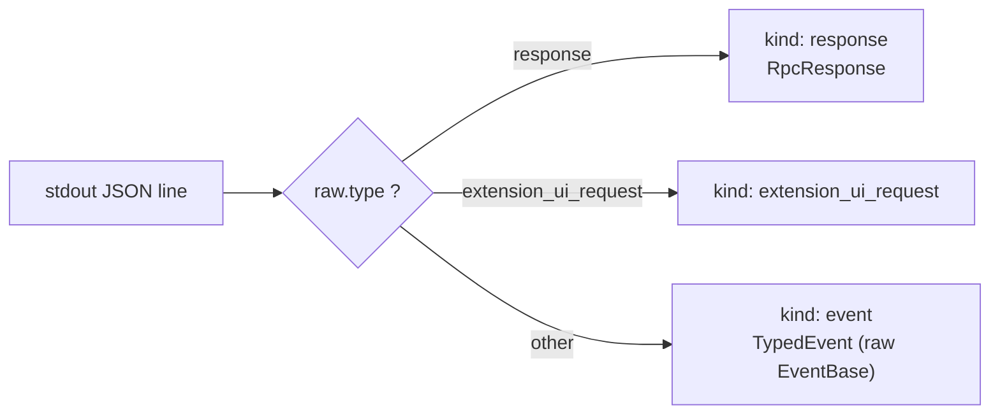
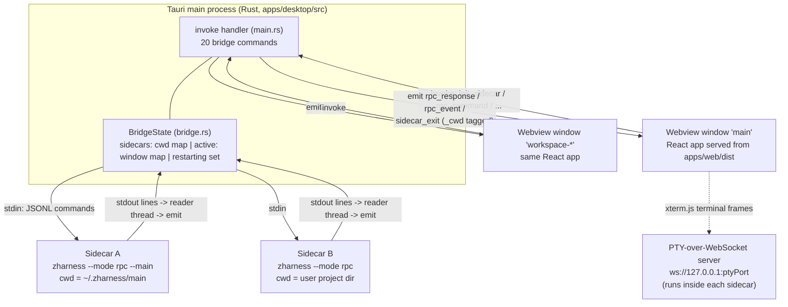
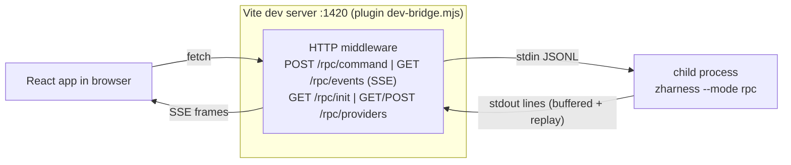

# 07-RPC 与桌面端

zharness 的对外集成面由三层组成：`packages/protocol` 定义与 agent 内部解耦的消息契约；`packages/rpc` 在 stdin/stdout 上实现 JSONL 服务端（`--mode rpc`）并提供 TS 客户端；`apps/desktop`（Tauri 2 + Rust）以 sidecar 方式为每个工作目录 spawn 一个 `zharness --mode rpc` 子进程，`apps/web` 是同一套前端代码同时跑在 Tauri webview 和浏览器里。本文所有结论均来自源码核实。

## 7.1 协议总览：一个契约，三条通道

| 消费方 | 载体 | 前端接入点 |
| --- | --- | --- |
| 桌面端（Tauri） | Rust bridge 读写 sidecar 进程的 stdin/stdout，经 `emit` 推给 webview | `invoke` + `listen`（`apps/web/src/lib/transport.ts:L22-L158`） |
| 浏览器开发模式 | Vite 插件 `dev-bridge.mjs` spawn `zharness --mode rpc`，暴露 HTTP/SSE | `fetch("/rpc/command")` + `EventSource("/rpc/events")`（同文件 `L583-L653`） |
| 编程嵌入方 / 测试 | `RpcClient` 类直接 spawn 子进程并做请求-响应关联（`packages/rpc/rpc-client.ts:L65`） | 类型化方法调用 |

术语澄清：仓库文档（如 CODE_WIKI.md）把这套协议称作 "JSON-RPC"，但代码实现并不是 JSON-RPC 2.0——没有 `jsonrpc`/`method`/`params` 字段。它是自定义的 LF 分隔 JSON 行协议：命令用 `type` 字段判别，可选 `id` 用于响应关联；版本常量 `PROTOCOL_VERSION = 1`（`packages/protocol/index.ts:L389`）。以代码为准。

## 7.2 packages/protocol — 零依赖消息契约

设计动机写在包头注释里：web 等消费方不应为了拿到类型而安装整个 agent 核心，所以引用 agent 内部类型（`AgentMessage`、`CompactionResult`、`SessionStats` 等）的字段一律声明为 `unknown` 占位；agent 侧在 `packages/rpc/rpc-types.ts` 用真实类型参数 re-export 一份强类型覆盖版（`packages/protocol/index.ts:L1-L9`、`packages/rpc/rpc-types.ts:L44-L118`）。该包无任何依赖，通过 `file:` 协议被根 `package.json:L73` 与 `apps/web/package.json:L15` 引用。

### 命令清单（stdin，`RpcCommand` 并集，index.ts:L36-L109）

按用途分组（均为 `{ id?: string; type: "..."; ... }` 形状）：

| 分组 | type |
| --- | --- |
| 提问与流控 | `prompt`（可带 `images`、`streamingBehavior: "steer" \| "followUp"`）、`steer`、`follow_up`、`abort`、`rewind` |
| 状态 | `get_state`、`get_messages`、`get_last_assistant_text` |
| 模型 | `set_model`、`cycle_model`、`get_available_models` |
| 思考档位 | `set_thinking_level`、`cycle_thinking_level` |
| 队列模式 | `set_steering_mode`、`set_follow_up_mode` |
| 压缩 | `compact`、`set_auto_compaction` |
| 重试 | `set_auto_retry`、`abort_retry` |
| 直连 Bash | `bash`、`abort_bash` |
| 会话树操作 | `get_session_stats`、`export_html`、`switch_session`、`fork`、`clone`、`get_fork_messages`、`new_session` |
| 斜杠命令/技能 | `get_commands`、`get_skills` |
| 历史树与事件取证 | `history_tree`（`list`/`view`/`jump`/`fork`/`rename` 五个 action）、`get_events` |
| Safe mode 审批 | `approve`、`reject`、`set_safe_mode` |
| 扩展管理 | `get_extensions`、`set_extension_enabled`、`install_extension`、`uninstall_extension` |
| 凭据热加载 | `reload_providers` |

小怪点：并集中 `new_session` 字面量重复出现了两次（`index.ts:L99-L100`），对 TypeScript 无害，属冗余。

### stdout 行判别

stdout 上的每一行都是三种之一，客户端用 `classifyLine()` 区分（`index.ts:L364-L377`）：



- `RpcResponse`：`{ id?, type: "response", command, success, data?/error? }`，任何命令都可能返回 `success: false`（`index.ts:L206-L273`）。
- `TypedEvent`：事件存储的原始 `EventBase`（`event_id`/`type`/`payload`/...）原样转发（`index.ts:L353-L358`）。
- `RpcExtensionUIRequest`/`RpcExtensionUIResponse`：扩展 UI 对话框通道（见 7.8，实际处于"定义了但未闭环"状态）。

### 关键负载

- `RpcSessionState`（`index.ts:L165-L183`）：模型信息、thinkingLevel、isStreaming、sessionFile/sessionId、autoCompactionEnabled、safeMode、`ptyPort`（终端面板用的本地 WebSocket 端口）、`contextUsage`（tokens/contextWindow/percent）与 `tokenUsage` 累计值。
- `RpcHistoryTreeNode`/`RpcHistoryTreeResult`/`RpcForensicEvent`（`index.ts:L280-L321`）：供 web 右侧 dock 渲染会话树与事件时间线，字段直接采用事件存储的 snake_case 命名。

## 7.3 packages/rpc — JSONL 帧与服务端

### 严格 JSONL 帧（jsonl.ts）

`serializeJsonLine()` 输出 LF 结尾的单行 JSON；`attachJsonlLineReader()` 手写逐行解析。注释明确说明刻意不用 Node `readline`——readline 会按 U+2028/U+2029 等 Unicode 分隔符切行，而它们可能合法出现在 JSON 字符串内，会破坏帧完整性（`packages/rpc/jsonl.ts:L10-L58`）。

### stdout 洁净化（问题 → 方案）

问题：RPC 模式下 stdout 就是协议通道，任何库里的 `console.log` 都会污染数据流且极难排查。方案：`runRpcModeWithFacade` 入口第一行调用 `takeOverStdout()`（`packages/rpc/rpc-mode.ts:L405`），它把全局 `process.stdout.write` 重定向到 stderr，只保留一个私有的 raw writer；协议输出必须走 `writeRawStdout()`（`src/core/output-guard.ts:L9-L56`，rpc-mode.ts:L445-L447）。

### 服务端主循环 `runRpcModeWithFacade(facade)`（rpc-mode.ts:L404-L960）

启动序列：

1. `takeOverStdout()`；
2. 启动 PTY-over-WebSocket 服务器（端口随机分配），失败不致命——`ptyPort` 缺席时终端面板降级（`rpc-mode.ts:L409-L416`，实现在 `packages/pty/pty-server.ts:L104`）；
3. 定制扩展 UI 上下文：`notify` 转写成 `CUSTOM_MESSAGE` 事件写入事件存储从而自然流入 stdout；`confirm` 自动批准 `true`（面向无头场景的设计，rpc-mode.ts:L422-L443）；其余 UI 方法沿用 `noOpUIContext`（`src/core/extensions/runner.ts:L196-L224`）；
4. `facade.subscribe(event => output(event))` 把全量事件原样输出（rpc-mode.ts:L942）；
5. stdin `end` 触发优雅 shutdown（dispose facade、关 PTY server，rpc-mode.ts:L498-L512、L945-L957）；SIGTERM/SIGHUP 时先 `killTrackedDetachedChildren()` 再退出（L480-L494）。

`handleCommand` 大 switch（L514-L899）的行为要点：

| 命令 | 行为特征 |
| --- | --- |
| `prompt` | 异步 fire-and-forget：立即回 success，后续错误另发一条 error response（L518-L522） |
| `compact` | 同步等待 `COMPACTION_END` 事件，30 秒超时（L463-L478、L600-L607） |
| `rewind`/`fork`/`clone`/`switch_session` | 直接驱动 `runtime.sessionManager`/`store`；`resolveSessionId` 校验 workspace 归属防跨工作区切换（L310-L316、L617-L662） |
| `history_tree` | 五个 action 全部基于 `buildHistoryTreeNodes` + sessionManager 实现（L685-L751） |
| `get_events` | 支持 `eventTypes` 过滤与 `sessionScoped`（按当前 session 的 event_range 查询），默认截取最后 1000 条（L753-L772、L97-L104） |
| `approve`/`reject`/`set_safe_mode` | 接 runtime 的 safe mode 审批（L802-L815） |
| `install_extension`/`uninstall_extension` | `lifecycleInFlight` Map 按扩展 id 去重，防止并发 install 抢 Chrome 下载锁死锁（L243-L290） |
| `reload_providers` | 重新从 auth.json 加载凭据并刷新模型注册表——专门配合桌面端在进程外改写 auth.json 的场景（L878-L892） |

协议兼容性桩：`set_steering_mode`、`set_follow_up_mode`、`set_auto_retry`、`abort_bash` 直接返回 success 不做任何事；`abort_retry` 只是转调 `facade.abort()`（L774-L788、L797-L801）。这些是 TUI 时代遗留的命令形状，服务端保留兼容。另外入口处会把收到的 `extension_ui_response` 行静默吞掉（L916-L923），即该反向通道目前没有实际消费者。

### TS 客户端 `RpcClient`（rpc-client.ts）

- `start()` 默认 spawn `node dist/cli.js --mode rpc`；`binary: true` 时把 `cliPath` 当作编译产物直接执行（Bun 单文件二进制分发场景，不带 node 前缀）（L27-L50、L97-L106）。注意默认路径是 `dist/cli.js`，而 npm `bin` 字段指向 `dist/src/cli.js`（根 package.json:L11）——两者是否都有构建流程产出未验证。
- `send()` 自增生成 `req_N` 作为 id，30 秒超时；`handleLine()` 按 id 匹配 pendingRequests，未匹配则当作事件分发给监听器（L477-L527）。
- `waitForIdle()`/`collectEvents()` 以 `AGENT_TURN_COMPLETED`（或旧式 `agent_end`）为空闲信号（L425-L462、L541-L544）。
- 桌面端不使用这个类——Rust bridge 自己实现了等价逻辑；此客户端主要面向嵌入方与测试。

## 7.4 apps/desktop — Tauri 2 桌面编排

Rust 包名 `zharness-gui`，tauri 2.1 + `tauri-plugin-shell`/`tauri-plugin-dialog`（`apps/desktop/Cargo.toml:L2-L15`）。源码只有两个文件：`src/main.rs`（56 行，注册 20 个 invoke command）和 `src/bridge.rs`（约 1790 行，全部桥逻辑）。

### BridgeState：多窗口 × 多 sidecar 的核心数据结构

```rust
pub struct BridgeState {
    sidecars: Mutex<HashMap<String, SidecarEntry>>, // cwd -> 进程+stdin
    active: Mutex<HashMap<String, String>>,         // window label -> cwd
    restarting: Mutex<HashSet<String>>,             // 正在被 restart_sidecar 重启的 cwd
}
```
（`apps/desktop/src/bridge.rs:L225-L235`）

模型：**每个工作目录（cwd）最多一个 sidecar，多个窗口可通过 active 指针共享同一个 sidecar**。切换工作区绝不杀旧进程（注释明确写了 "never kill the old sidecar on switch — it persists"，bridge.rs:L420-L421）。窗口关闭时 `CloseRequested` 回调调 `kill_sidecar_for_window`，只有当没有其他窗口还在用该 cwd 时才真正杀进程（`main.rs:L46-L53`、bridge.rs:L259-L279）。`new_workspace` 创建 `workspace-{uuid}` 标签的新窗口加载同一个 `index.html`（bridge.rs:L804-L829）。

### sidecar 可执行文件的解析（三级优先）

`resolve_zharness_command()`（bridge.rs:L149-L217）：

1. 环境变量 `ZHARNESS_BIN` 显式覆盖（任意可执行文件，可带参数）；
2. 打包资源 `<resource_dir>/zharness(.exe)` —— 仅 release 构建生效，使桌面应用自包含、无需 Node（平台打包见 `tauri.conf.json:L55-L64` 与 `tauri.windows.conf.json`/`tauri.macos.conf.json`/`tauri.linux.conf.json`，三者都把 `dist/zharness(.exe)` 放进 bundle.resources）;
3. 开发回退：`node --loader scripts/module-resolver.mjs dist/src/cli.js --mode rpc`（从仓库源码树跑）。

node 解释器的查找顺序：`ZHARNESS_NODE` → nvm 最新版本 → homebrew/system 常见路径 → PATH 上的 `node`（`find_node`，bridge.rs:L40-L74）。

macOS 特有问题（问题 → 具体例子 → 方案）：GUI 启动的子进程继承的是 launchd 的最小 PATH，不会 source 用户 shell rc 文件，homebrew/cargo/nvm 安装的工具全部找不到。方案：`capture_login_shell_path()` 执行一次 `<shell> -lic 'printf %s "$PATH"'`（stdin 接 /dev/null、3 秒硬超时防止 rc 文件卡死），结果经 `OnceLock` 按进程缓存后显式传给 sidecar（bridge.rs:L83-L147、L444）。

Windows 上 spawn 时加 `CREATE_NO_WINDOW (0x08000000)` 抑制控制台窗口（bridge.rs:L451-L455）。

### init_sidecar 流程（bridge.rs:L328-L698)

1. 解析 cwd（展开 `~`）；持久 Chat 工作区 `~/.zharness/main` 不存在则自动创建（它是桌面应用默认启动工作区），并额外附加 `--main` 参数让 agent 以 main-agent 模式初始化（L360-L372、L423-L429）。
2. 若该 cwd 已有 sidecar：只切换 active 指针并向其发 `get_state`，立即返回空对象——状态随后经由事件到达前端（L379-L418）。
3. 否则 spawn 新进程，同步写入一条 `get_state` 并阻塞读第一行作为握手应答。读到 EOF 说明 sidecar 秒退：回收子进程、join stderr 收集线程、取 stderr 尾部最多 4 KB 附在错误里返回，让用户看到崩溃原因而非裸退出码（例如 main agent 的 ".lock 被占用"）（L496-L560）。
4. 成功后登记 sidecar、设置 active 映射，并启动 reader 线程。

### reader 线程：stdout 到 webview 的事件分发

每个 sidecar 一条线程逐行读 stdout（bridge.rs:L584-L694）：

- 按 `type` 分三路 emit 给**所有**窗口（前端再用 `_cwd` 过滤）：`response` → `rpc_response`（注入 `_cwd`）、`extension_ui_request` → 同名事件、其余 → `rpc_event`（注入 `_cwd`）（L607-L646）；
- 读到 EOF：从 map 摘除并 `wait()` 回收子进程避免僵尸；若该 cwd 处于 `restarting` 集合则抑制 `sidecar_exit` 广播，防止 GUI 的自动重启循环与用户手动重启互相踩踏（L659-L693）。

`rpc_command`（前端唯一常规下行通道）：缺 id 则补 uuid v4，路由到本窗口 active cwd 对应 sidecar 的 stdin（L760-L801）。`restart_sidecar` 先占 `restarting` 槽位再 kill+wait，并 sleep 150 ms 等操作系统释放进程槽与 `~/.zharness/main` 的 .lock 文件，然后复用 `init_sidecar`（L710-L749）。

### 凭据与 provider 管理（Rust 拥有文件写权限）

webview 是沙箱，不能直接碰 `~/.zharness/agent/`，因此相关文件全部由 Rust 侧读写：

- `auth.json`：`set_provider_api_key`/`remove_provider_api_key` 写完后 chmod 600（Unix）并 `broadcast_to_all_sidecars("reload_providers")`——因为凭据文件跨所有工作区共享，而每个 sidecar 只在内存缓存（bridge.rs:L289-L323、L1118-L1204）。
- `models.json`：`add_custom_provider`/`remove_custom_provider` 维护 OpenAI 兼容自定义 provider，条目形状刻意对齐 TS 侧 `ProviderConfigSchema`（注释指到 `src/core/model-registry.ts:196`），写完同样广播 reload（L1230-L1344）。
- `fetch_openai_models`：用 reqwest 代抓 `{baseUrl}/models`，绕开 webview CORS；失败返回空列表走手动输入回退（L1352-L1391）。

其余桥命令一览：

| 命令 | 作用 |
| --- | --- |
| `list_workspaces`/`delete_workspace`/`reveal_workspace` | 读删 `~/.zharness/agent/workspaces/*/meta.json`，删除时连带杀对应 sidecar（L832-L958） |
| `list_dir`/`read_file` | 文件浏览器后端；跳过 `.git`/`node_modules`/`target` 等目录，单文件上限 2 MB（L1625-L1735） |
| `open_in_editor`/`reveal_path` | 按 Cursor→Windsurf→VS Code→Zed→Sublime 顺序探测后打开文件/在文件管理器中定位（L1506-L1620） |
| `transcribe_audio` | 取 auth.json 里 openai key，调 OpenAI Whisper 云 API 转写语音输入（L1417-L1482） |
| `fetch_skills_sh` | 代抓 skills.sh HTML 绕 CORS，前端解析技能链接（L1739-L1763） |
| `set_window_background` | 主题自适应背景色（L1400-L1410） |

调试日志统一追加写到 `/tmp/zharness-gui-bridge.log`（bridge.rs:L29-L38）；Windows 原生环境通常不存在 `/tmp`，打开失败会被静默忽略，等于 Windows 上无日志。

权限面：`capabilities/default.json` 只对 `main` 与 `workspace-*` 两类窗口开放 core 事件、窗口拖拽、shell execute/open 与 dialog 权限。

## 7.5 apps/web — 前端栈与 transport 双通道

技术栈（`apps/web/package.json`）：React 18 + react-router-dom 6 + i18next（en/zh-CN）+ Tailwind CSS 4（@tailwindcss/vite 插件）+ Vite 6 + @pxlkit/ui-kit + xterm.js（终端面板）+ lucide-react + react-markdown。构建脚本 `tsc -b && vite build` 产出到 `apps/web/dist`，正是 Tauri 的 `frontendDist`（`tauri.conf.json:L16`）；开发时 Tauri 的 `beforeDevCommand` 在 `../web` 里执行 `bun run dev` 起端口 1420 的 Vite dev server（`tauri.conf.json:L7-L11`）。

### transport.ts：运行环境探测与统一 API

`isTauri()` 以 `window.__TAURI_INTERNALS__` 判定运行环境（`transport.ts:L16-L18`），同一套函数在两个世界分别落地：

| 操作 | Tauri | 浏览器 |
| --- | --- | --- |
| 发命令 | `invoke("rpc_command", { command })` | `POST /rpc/command` |
| 等待响应 | 先注册 `listen("rpc_response")` 再发送，按 `id` 匹配（先注册是为防响应早于 invoke 返回的竞态） | 先挂 waiter 再发送，SSE 流按 id 匹配，兜底匹配最老 waiter（L589-L634） |
| 订阅事件 | `listen("rpc_event")` | `EventSource("/rpc/events")`（SSE） |
| 初始化 | `invoke("init_sidecar", { cwd })` | `GET /rpc/init`（桥代发 get_state） |
| sidecar 退出 | `listen("sidecar_exit")` | 无概念，返回空取消函数 |

`sendCommandAwait` 对超时/重载竞态处理得很细：多个完成路径竞争时只 settle 一次，页面重载导致 Tauri 监听注册表销毁时 `unlisten` 用 try/catch 吞错（L44-L102）。

### dev-bridge.mjs（仅开发期存在）

Vite 插件在 `configureServer` 钩子里挂 HTTP 中间件并 spawn `zharness --mode rpc` 子进程（依赖 PATH 上已安装 zharness，spawn 失败只打 console.error，`scripts/dev-bridge.mjs:L116-L152`）：

- `POST /rpc/command` — 命令透传 stdin；
- `GET /rpc/events` — SSE 流，新连接先回放已缓冲的历史行再挂载（L273-L290）；
- `GET /rpc/init` — 代发 get_state，轮询缓冲区直到拿到应答或 10 秒超时（L159-L219）；
- `GET/POST /rpc/providers` — 直接读写 auth.json（Node 端无沙箱限制），provider 显示名来自构建期生成的 `dist/providers.json`（L16-L79）。

该插件只影响 dev server，不影响生产构建产物；生产浏览场景没有官方支持（transport 的 SSE 路径主要服务本地开发预览）。

### App.tsx 的编排逻辑（apps/web/src/App.tsx）

- Tauri 下启动即连默认持久工作区：`startWithWorkspace("~/.zharness/main")`（L94-L104）；浏览器下无参初始化走 dev bridge。
- `sidecar_exit` 触发自动重启：指数退避（1s→2s→4s 封顶），最多 3 次，计数器在 sidecar 恢复健康后清零（L147-L176）。
- 事件流按 `_cwd` 双重过滤：非活跃工作区的事件仅用于侧边栏 streaming 指示灯（AGENT_TURN_START/COMPLETED），状态刷新只认活跃工作区（L184-L205）。
- 首启检测：`get_state` 返回 `model === undefined` 表示没配任何 key，自动重定向到 setup 模式的 Settings 页；配置成功重启 sidecar 后自动跳回（L250-L276）。`restartSidecar` 返回的是新 sidecar 第一条 get_state 的完整 response 信封，需解开 `.data` 再入 state（L346-L369）。

## 7.6 桌面端进程关系图



要点：Rust 主进程是唯一的进程管理者与消息总线；sidecar 之间互不感知；webview 之间也不直连，一切经 Rust `emit` 广播（带 `_cwd` 让前端自行过滤）。终端面板是唯一绕开 JSONL 总线的旁路通道——webview 直接连 sidecar 内起的 WebSocket PTY 服务器（`apps/web/src/components/Terminal.tsx:L51-L52`），CSP 相应放行了 `ws://127.0.0.1:*`（`tauri.conf.json:L42`）。

浏览器开发模式的等价拓扑：



## 7.7 PTY over WebSocket（终端面板后端）

`startPtyServer` 在 sidecar 进程内起一个绑定 127.0.0.1 随机端口的 WebSocket 服务器（`packages/pty/pty-server.ts:L104-L114`）。文本帧为 JSON：客户端发 `spawn`/`input`/`resize`/`kill`，服务端回 `ready`/`output`/`exit`/`error`（L8-L23 注释即协议文档）。node-pty 懒加载：在 Bun 编译的二进制里 node_modules 被剥离，import 失败时回退到按绝对路径加载 `pty.node` 预编译件的 minimal loader，保证缺原生模块时降级而不是崩掉 sidecar（L21-L22、L50-L88）。小瑕疵：连接结束时 `exit` 帧连续发送两次（L145-L146），无害冗余。

## 7.8 相关路径、怪点与文档分歧

- `zharness gui` / `--mode gui`（`packages/cli/args.ts:L75-L84`）走的是另一条路：`packages/http-bridge/server.ts` 的 `runGuiModeWithFacade` 起 HTTP+SSE 服务器（`src/modes/index.ts:L10` 导出）。它与桌面端无关，属于早期的独立 GUI 服务模式，本页不展开。
- 协议中的 `extension_ui_request`/`extension_ui_response` 通道处于半成品状态：类型与 `classifyLine` 判别都在（protocol/index.ts:L328-L347），Rust reader 也转发同名事件，但 RPC 服务端从不构造 request（UI 上下文里 select/input 等都是 no-op，confirm 直接批准），stdin 收到的 response 也会被吞掉（rpc-mode.ts:L916-L923），apps/web 里没有任何 `extension_ui` 相关代码。整条链路目前是死代码。
- 文档分歧：CODE_WIKI.md 称其为 "JSON-RPC 服务" 并引用了旧行号（如 rpc-mode.ts:403-931）；实际协议为自定义 JSONL（见 7.1），当前函数体位于 rpc-mode.ts:L404-L960。
- `init_sidecar` 已运行快路径返回空对象 `{}` 是有意设计：前端据此知道要另行显式拉一次 `get_state`（App.tsx:L66-L78）。

---
相关页面：[02-架构总览](02-架构总览.md)（分层全景）、[06-运行模式与界面](06-运行模式与界面.md)（各模式入口与 TUI）、[08-持久化Agent与扩展](08-持久化Agent与扩展.md)（`--main` 模式与扩展系统）、[04-事件存储与会话树](04-事件存储与会话树.md)（`history_tree`/`get_events` 背后的存储模型）。
